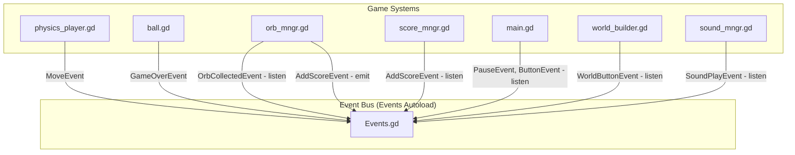

# Research: Event System Analysis

## Current Event System Architecture

### Core Event Manager

Location: `addons/dynamic_event_manager/src/Events.gd`

```gdscript
extends Node

var events := {}  # Dictionary mapping event_class -> [Callable]

func add_listener(event_class: GDScript, method: Callable) -> void:
    if !events.has(event_class):
        events[event_class] = []
    events[event_class].push_front(method)

func remove_listener(event_class: GDScript, method: Callable) -> void:
    if events.has(event_class) && events[event_class].has(method):
        events[event_class].erase(method)

func invoke(event: Event) -> void:
    var event_class = event.get_script()
    if events.has(event_class):
        var listeners = events[event_class]
        for i in range(listeners.size() - 1, -1, -1):
            await listeners[i].call(event)
```

### Event Classes Inventory

| Event | Properties | Static State | Pause Check |
|-------|------------|--------------|-------------|
| `AddScoreEvent` | `_score: int` | No | Yes |
| `OrbCollectedEvent` | `_props: OrbProps` | No | Yes |
| `PauseEvent` | `_pause: bool` | **Yes: `state`** | No |
| `MoveEvent` | `_move: int, _pressed: bool, _power: float` | No | Yes |
| `GameOverEvent` | None | No | Yes |
| `ReplayEvent` | None | No | No |
| `ButtonEvent` | `_type: MainButtonType` | No | No |
| `WorldButtonEvent` | `_type: WorldButtonType` | No | No |
| `SoundPlayEvent` | `_type: SoundType, _sound: Sounds` | No | No |
| `SoundEnableEvent` | `_type: SoundType, _command: SoundCmd` | No | No |
| `VolumeSetEvent` | `_type: SoundType, _volume: float` | No | No |
| `WorldBuiltEvent` | None | No | No |
| `GameLoadEvent` | `_saved_game: SavedGame` | No | No |
| `PauseScreenEvent` | None | No | Yes |

### Event Flow Diagram



### Global State Issue: PauseEvent.state

**Current Pattern:**
```gdscript
# In PauseEvent.gd
class_name PauseEvent extends Event
static var state = false  # <-- GLOBAL STATE

static func invoke(pause: bool):
    state = pause  # Mutates static state
    Events.invoke(PauseEvent.new(pause))
```

**Usage Pattern in Other Events:**
```gdscript
static func invoke(...):
    if PauseEvent.state == false:  # Checks global state
        Events.invoke(...)
```

**Problems:**
1. Static state persists across scene reloads
2. Not reset between test runs without explicit cleanup
3. Implicit coupling - events "know" about pause state
4. Hard to reason about state flow

### Event Listeners by Script

| Script | Listens To |
|--------|------------|
| `main.gd` | ReplayEvent, PauseEvent, ButtonEvent |
| `world_builder.gd` | WorldButtonEvent, PauseScreenEvent |
| `physics_player.gd` | MoveEvent |
| `score_mngr.gd` | AddScoreEvent, GameLoadEvent |
| `orb_mngr.gd` | OrbCollectedEvent |
| `sound_mngr.gd` | SoundPlayEvent, GameOverEvent, WorldBuiltEvent, VolumeSetEvent, SoundEnableEvent |
| `hud.gd` | AddScoreEvent, GameLoadEvent |
| `ball.gd` | (none - emits only) |
| `generic_orb.gd` | (none - emits only) |

### Identified Issues

1. **Static State Coupling**: `PauseEvent.state` creates hidden dependencies
2. **No Listener Cleanup**: Scripts add listeners in `_ready()` but rarely remove them
3. **Event Proliferation**: 14 event classes for a simple game
4. **Mixed Event Patterns**: Some check pause, some don't - inconsistent
5. **Async Invocation**: `await` in event dispatch can cause timing issues

### Refactor Recommendations

1. **Create GameState Autoload**: Move `PauseEvent.state` to proper singleton
   ```gdscript
   # game_state.gd
   extends Node
   signal pause_changed(is_paused: bool)
   var is_paused: bool = false:
       set(v):
           if v != is_paused:
               is_paused = v
               pause_changed.emit(v)
   ```

2. **Remove Pause Checks from Events**: Events should just be signals
   - Let consumers decide if they should respond

3. **Add Listener Management**: Use `p` connected signals or track listeners for cleanup

4. **Consider Signal-Based Approach**: Godot's built-in signals may be cleaner for some use cases
