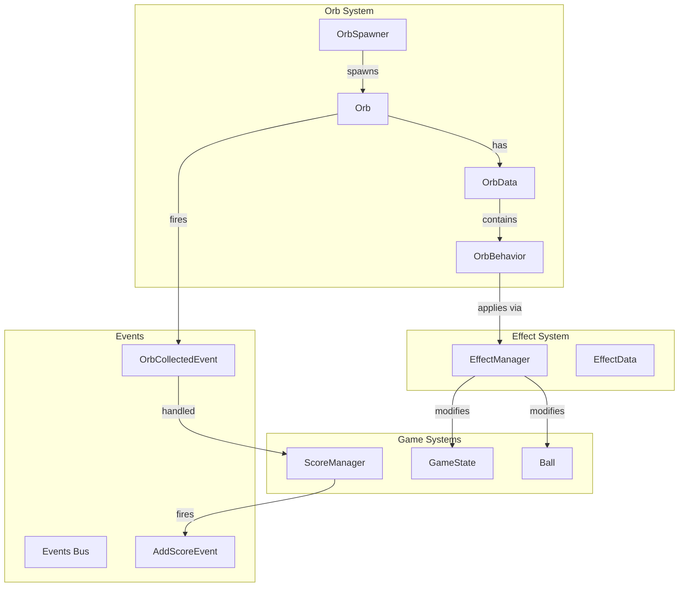
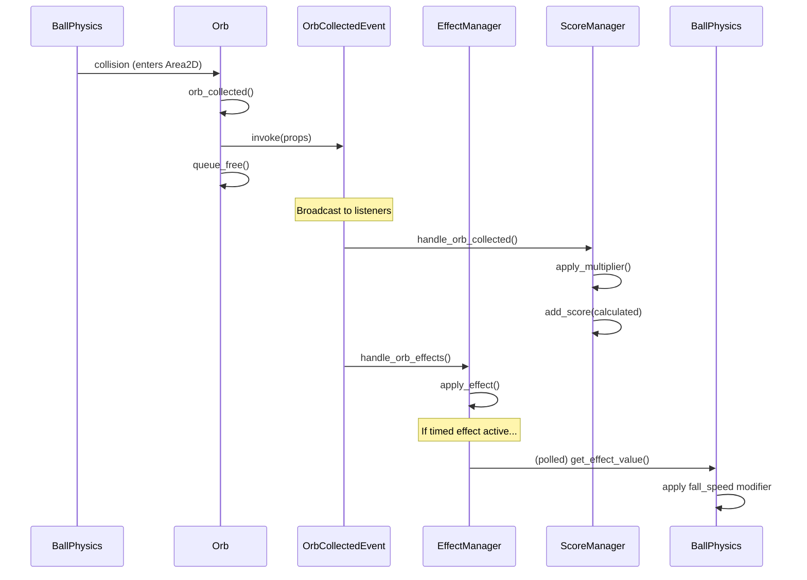

# Detailed Design: Orb System Expansion

## Overview

This document defines the architecture and implementation plan for expanding the orb system in "Don't Drop the Ball" from 3 hardcoded orb types to a modular, data-driven system supporting 12+ orb types with effects, stacking, and varied behaviors.

### Goals
- Replace duplicated orb scripts with unified data-driven architecture
- Support instant effects, timed effects, stacking, movement, and chain reactions
- Enable new orb creation via Resource files (no new scripts for most cases)
- Maintain existing gameplay feel and scoring balance

### Non-Goals
- Monetization or progression systems
- UI overhaul for effect indicators
- Complex visual effects beyond simple sprites

---

## Detailed Requirements

### Functional Requirements

| ID | Requirement | Priority |
|----|-------------|----------|
| FR-1 | Unified orb scene replaces BlueOrb, RedOrb, HalfSolidOrb, GenericOrb | High |
| FR-2 | OrbData resource defines all orb properties (sprite, score, lifespan, behaviors) | High |
| FR-3 | EffectManager singleton tracks active effects with stack/refresh rules | High |
| FR-4 | Support 9 new orb types in first content pack | High |
| FR-5 | Weighted spawn system with rarity tiers | Medium |
| FR-6 | Line orbs collect all orbs in vertical/horizontal line | Medium |
| FR-7 | Burst orb collects all orbs within radius | Medium |
| FR-8 | Time slow affects Engine.time_scale | Medium |
| FR-9 | Slow fall modifies ball.fall_speed | Medium |
| FR-10 | Combo starter creates chain multiplier | Medium |
| FR-11 | Double value makes next orb worth 2x | Low |
| FR-12 | Drifter orb moves horizontally | Low |
| FR-13 | Score multiplier stacks for higher values | High |

### Non-Functional Requirements

| ID | Requirement |
|----|-------------|
| NFR-1 | All orb logic must be unit-testable |
| NFR-2 | New orb types require only Resource files (no scripts) |
| NFR-3 | Effect stacking must be deterministic and documented |
| NFR-4 | Migration preserves existing score values and gameplay feel |
| NFR-5 | All changes validated via ./devscripts/test.sh |

### Constraints

- Godot 4.4.1, GDScript, typed
- Keep diffs small and focused
- No large asset work (placeholder sprites acceptable)
- Preserve ball bounce mechanic unchanged
- 45 second effect duration (10s for time-altering effects)

---

## Architecture Overview

### System Context Diagram



### Data Flow: Orb Collection



---

## Components and Interfaces

### 1. OrbData (Resource)

**File:** `scripts/data/orb_data.gd`

```gdscript
class_name OrbData extends Resource

## Display Properties
@export var display_name: String = "Orb"
@export var texture: Texture2D
@export var scale: Vector2 = Vector2.ONE

## Gameplay Properties
@export var base_score: int = 1
@export var lifespan: float = 30.0
@export var rarity: Enums.OrbRarity = Enums.OrbRarity.COMMON

## Physics Properties
@export var collision_radius: float = 32.0
@export var is_half_solid: bool = false
@export var half_solid_texture: Texture2D  ## For HalfSolidOrb split display

## Behaviors
@export var behaviors: Array[OrbBehavior] = []

## Spawn Animation
@export var spawn_animation_duration: float = 1.5
```

### 2. OrbBehavior (Abstract Resource)

**File:** `scripts/data/orb_behavior.gd`

```gdscript
class_name OrbBehavior extends Resource

## Unique identifier for this behavior type
@export var behavior_id: String = ""

## Called when orb is collected by the ball
## context: { "orb": Orb, "orb_data": OrbData, "collector": Node }
func execute(context: Dictionary) -> void:
    push_warning("OrbBehavior.execute() not implemented in base class")

## Called each physics frame while orb is active (for movement)
func process(orb: Node, delta: float) -> void:
    pass

## Called during spawn animation phase
func on_spawn(orb: Node, progress: float) -> void:
    pass
```

### 3. Concrete Behaviors

#### ScoreBehavior
**File:** `scripts/data/behaviors/score_behavior.gd`

```gdscript
class_name ScoreBehavior extends OrbBehavior

@export var score_value: int = 1

func _init():
    behavior_id = "score"

func execute(context: Dictionary) -> void:
    var final_score = score_value

    # Apply score multiplier if active
    if EffectManager.has_effect("score_multiplier"):
        var multiplier = EffectManager.get_effect_value("score_multiplier")
        final_score = int(final_score * multiplier)

    # Apply combo multiplier if active
    if EffectManager.has_effect("combo_chain"):
        var combo_count = EffectManager.get_effect_value("combo_chain")
        final_score = int(final_score * (1.0 + combo_count * 0.5))

    # Apply double value if active (one-time)
    if EffectManager.has_effect("double_value"):
        final_score *= 2
        EffectManager.remove_effect("double_value")

    AddScoreEvent.invoke(final_score)
```

#### TimedModifierBehavior
**File:** `scripts/data/behaviors/timed_modifier_behavior.gd`

```gdscript
class_name TimedModifierBehavior extends OrbBehavior

@export var effect_id: String = ""
@export var effect_value: float = 1.0
@export var duration: float = 45.0

func _init():
    behavior_id = "timed_modifier"

func execute(_context: Dictionary) -> void:
    EffectManager.apply_effect(effect_id, effect_value, duration)
```

#### ChainReactionBehavior
**File:** `scripts/data/behaviors/chain_reaction_behavior.gd`

```gdscript
class_name ChainReactionBehavior extends OrbBehavior

@export var radius: float = 150.0

func _init():
    behavior_id = "chain_reaction"

func execute(context: Dictionary) -> void:
    var orb = context.get("orb")
    if not orb:
        return

    var nearby_orbs = _get_orbs_in_radius(orb.global_position, radius)
    for nearby in nearby_orbs:
        if nearby != orb and nearby.has_method("collect"):
            nearby.collect()
```

#### MovementBehavior
**File:** `scripts/data/behaviors/movement_behavior.gd`

```gdscript
class_name MovementBehavior extends OrbBehavior

@export var speed: float = 50.0
@export var direction: Vector2 = Vector2.RIGHT
@export var oscillate: bool = true
@export var oscillate_distance: float = 100.0

var _start_position: Vector2
var _oscillating_direction: int = 1

func _init():
    behavior_id = "movement"

func on_spawn(orb: Node, _progress: float) -> void:
    _start_position = orb.global_position

func process(orb: Node, delta: float) -> void:
    var movement = direction * speed * delta * _oscillating_direction
    orb.global_position += movement

    if oscillate:
        var distance_from_start = abs(orb.global_position.x - _start_position.x)
        if distance_from_start >= oscillate_distance:
            _oscillating_direction *= -1
```

#### LineClearBehavior
**File:** `scripts/data/behaviors/line_clear_behavior.gd`

```gdscript
class_name LineClearBehavior extends OrbBehavior

enum LineDirection { VERTICAL, HORIZONTAL }

@export var direction: LineDirection = LineDirection.VERTICAL
@export var tolerance: float = 20.0
@export var visual_effect_color: Color = Color.YELLOW

func _init():
    behavior_id = "line_clear"

func execute(context: Dictionary) -> void:
    var orb = context.get("orb")
    if not orb:
        return

    var orbs_to_collect: Array[Node] = []

    if direction == LineDirection.VERTICAL:
        orbs_to_collect = _get_orbs_in_vertical_line(orb.global_position.x, tolerance)
    else:
        orbs_to_collect = _get_orbs_in_horizontal_line(orb.global_position.y, tolerance)

    _spawn_line_visual_effect(orb, direction)
    _delayed_collect(orbs_to_collect, orb)

func _delayed_collect(orbs: Array[Node], source_orb: Node) -> void:
    for target_orb in orbs:
        if target_orb != source_orb and target_orb.has_method("collect"):
            target_orb.collect()
```

### 4. Orb (Unified Scene + Script)

**File:** `scripts/orb.gd`

```gdscript
class_name Orb extends Node2D

## Components
@onready var sprite: Sprite2D = $Sprite
@onready var area: Area2D = $Area2D
@onready var collision: CollisionShape2D = $Area2D/CollisionShape2D
@onready var static_body: StaticBody2D = $StaticBody  ## For half-solid
@onready var static_collision: CollisionPolygon2D = $StaticBody/CollisionPolygon2D
@onready var timer: Timer = $Timer

## State
var orb_data: OrbData
var _spawn_progress: float = 0.0
var _is_spawning: bool = true

signal collected

func setup(data: OrbData) -> void:
    orb_data = data
    _apply_data()

func _apply_data() -> void:
    if not orb_data:
        return

    # Visual
    sprite.texture = orb_data.texture
    sprite.scale = orb_data.scale

    # Collision
    var circle = CircleShape2D.new()
    circle.radius = orb_data.collision_radius
    collision.shape = circle

    # Half-solid setup
    if orb_data.is_half_solid:
        static_body.visible = true
        # Configure half-solid collision polygon (semi-circle)
    else:
        static_body.visible = false

    # Timer
    timer.wait_time = orb_data.lifespan
    timer.start()

func _ready() -> void:
    add_to_group("orbs")
    add_to_group("orb")  # Singular for convenience

    # Connect signals
    area.body_entered.connect(_on_body_entered)
    timer.timeout.connect(_on_lifespan_timeout)

    # Start spawn animation
    _is_spawning = true
    sprite.modulate.a = 0.0
    collision.disabled = true

func _process(delta: float) -> void:
    if _is_spawning:
        _spawn_progress += delta / orb_data.spawn_animation_duration
        if _spawn_progress >= 1.0:
            _spawn_progress = 1.0
            _is_spawning = false
            collision.disabled = false

        sprite.modulate.a = _spawn_progress * 0.75  # Max 75% opacity during spawn

        # Notify behaviors of spawn progress
        for behavior in orb_data.behaviors:
            behavior.on_spawn(self, _spawn_progress)
    else:
        # Process active behaviors (movement, etc.)
        for behavior in orb_data.behaviors:
            behavior.process(self, delta)

func _on_body_entered(body: Node2D) -> void:
    if body.is_in_group("ball"):
        collect()

func collect() -> void:
    if orb_data == null:
        queue_free()
        return

    # Fire collection event
    OrbCollectedEvent.invoke(orb_data)

    # Execute behaviors
    var context = {
        "orb": self,
        "orb_data": orb_data,
        "collector": _get_ball()
    }
    for behavior in orb_data.behaviors:
        behavior.execute(context)

    # Play sound
    SoundPlayEvent.invoke(Enums.SoundType.SFX, Enums.Sounds.ORB_COLLECTED)

    # Cleanup
    collected.emit()
    queue_free()

func _on_lifespan_timeout() -> void:
    queue_free()

func _get_ball() -> Node:
    var balls = get_tree().get_nodes_in_group("ball")
    return balls[0] if balls.size() > 0 else null
```

### 5. EffectManager (Autoload)

**File:** `scripts/effect_manager.gd`

```gdscript
class_name EffectManager extends Node

signal effect_applied(effect_id: String, value: Variant)
signal effect_removed(effect_id: String)
signal effects_changed()

var _active_effects: Dictionary = {}  # effect_id -> ActiveEffect

class ActiveEffect:
    var effect_id: String
    var value: Variant
    var remaining_duration: float
    var stack_count: int = 1
    var source: Node

    func _init(id: String, val: Variant, dur: float, src: Node):
        effect_id = id
        value = val
        remaining_duration = dur
        source = src

func _ready() -> void:
    # Listen for game over to clear effects
    Events.add_listener(GameOverEvent, _on_game_over)

func _process(delta: float) -> void:
    var expired: Array[String] = []

    for effect_id in _active_effects.keys():
        var effect: ActiveEffect = _active_effects[effect_id]
        if effect.remaining_duration > 0:
            effect.remaining_duration -= delta
            if effect.remaining_duration <= 0:
                expired.append(effect_id)

    for effect_id in expired:
        remove_effect(effect_id)

func apply_effect(effect_id: String, value: Variant, duration: float, source: Node = null) -> void:
    if _active_effects.has(effect_id):
        # Stack existing effect
        var existing: ActiveEffect = _active_effects[effect_id]
        existing.stack_count += 1
        existing.value = _calculate_stacked_value(existing, value)
        existing.remaining_duration = duration  # Refresh duration
    else:
        # New effect
        var effect = ActiveEffect.new(effect_id, value, duration, source)
        _active_effects[effect_id] = effect

    effect_applied.emit(effect_id, value)
    effects_changed.emit()
    _apply_global_effects()

func remove_effect(effect_id: String) -> void:
    if _active_effects.erase(effect_id):
        effect_removed.emit(effect_id)
        effects_changed.emit()
        _apply_global_effects()

func has_effect(effect_id: String) -> bool:
    return _active_effects.has(effect_id)

func get_effect_value(effect_id: String) -> Variant:
    if _active_effects.has(effect_id):
        return _active_effects[effect_id].value
    return null

func get_stack_count(effect_id: String) -> int:
    if _active_effects.has(effect_id):
        return _active_effects[effect_id].stack_count
    return 0

func clear_all_effects() -> void:
    _active_effects.clear()
    effects_changed.emit()
    _apply_global_effects()

func _calculate_stacked_value(existing: ActiveEffect, new_value: Variant) -> Variant:
    match existing.effect_id:
        "score_multiplier":
            return min(existing.value * new_value, 10.0)  # Cap at 10x
        "slow_fall":
            return max(existing.value * new_value, 0.1)  # Cap at 90% reduction
        "time_slow":
            return max(existing.value * new_value, 0.25)  # Cap at 0.25x speed
        "combo_chain":
            return existing.value + 1  # Increment count
        _:
            return new_value

func _apply_global_effects() -> void:
    # Time scale
    if has_effect("time_slow"):
        Engine.time_scale = get_effect_value("time_slow")
    else:
        Engine.time_scale = 1.0

func _on_game_over(_event: GameOverEvent) -> void:
    clear_all_effects()
    Engine.time_scale = 1.0
```

**Register in project.godot:**
```
[autoload]
EffectManager="*res://scripts/effect_manager.gd"
```

### 6. OrbSpawner (Updated)

**File:** `scripts/orb_spawner.gd`

```gdscript
class_name OrbSpawner extends Node2D

@export var orb_scene: PackedScene
@export var spawn_zone: Rect2 = Rect2(Vector2(-200, -200), Vector2(400, 400))
@export var spawn_interval: float = 2.0
@export var max_orbs: int = 10

## Weighted spawn table - set in inspector
@export var spawn_table: Array[OrbSpawnEntry] = []

var _timer: Timer

func _ready() -> void:
    _timer = Timer.new()
    _timer.wait_time = spawn_interval
    _timer.autostart = true
    _timer.timeout.connect(_on_timeout)
    add_child(_timer)

func _on_timeout() -> void:
    if max_orbs > 0 and get_tree().get_nodes_in_group("orbs").size() >= max_orbs:
        return

    var orb_data = _select_orb_data()
    if orb_data == null:
        return

    var orb = orb_scene.instantiate()
    orb.setup(orb_data)

    var pos = Vector2(
        randf_range(spawn_zone.position.x, spawn_zone.position.x + spawn_zone.size.x),
        randf_range(spawn_zone.position.y, spawn_zone.position.y + spawn_zone.size.y)
    )
    orb.global_position = pos
    add_child(orb)

func _select_orb_data() -> OrbData:
    if spawn_table.is_empty():
        return null

    var total_weight := 0
    for entry in spawn_table:
        total_weight += entry.weight

    var roll := randi() % total_weight
    var cumulative := 0

    for entry in spawn_table:
        cumulative += entry.weight
        if roll < cumulative:
            return entry.orb_data

    return spawn_table[0].orb_data
```

**Supporting class:**
```gdscript
# scripts/data/orb_spawn_entry.gd
class_name OrbSpawnEntry extends Resource

@export var orb_data: OrbData
@export var weight: int = 100  # Higher = more likely to spawn
```

---

## Data Models

### OrbData Resource Files

Location: `resources/orbs/`

| File | Type | Properties |
|------|------|------------|
| blue_orb.tres | COMMON | score=2, lifespan=30, texture=blue.png |
| red_orb.tres | COMMON | score=3, lifespan=30, texture=red.png |
| half_solid_orb.tres | RARE | score=8, lifespan=18, is_half_solid=true |
| score_multiplier.tres | UNCOMMON | ScoreBehavior + TimedModifierBehavior(effect_id=score_multiplier, value=2.0, duration=45) |
| slow_fall.tres | UNCOMMON | ScoreBehavior(1) + TimedModifierBehavior(effect_id=slow_fall, value=0.5, duration=45) |
| burst.tres | RARE | ScoreBehavior(8) + ChainReactionBehavior(radius=150) |
| drifter.tres | UNCOMMON | ScoreBehavior(2) + MovementBehavior(speed=50, oscillate=true) |
| double_value.tres | UNCOMMON | ScoreBehavior(1) + TimedModifierBehavior(effect_id=double_value, value=true, duration=-1) |
| time_slow.tres | RARE | ScoreBehavior(5) + TimedModifierBehavior(effect_id=time_slow, value=0.5, duration=10) |
| combo_starter.tres | RARE | ScoreBehavior(3) + TimedModifierBehavior(effect_id=combo_chain, value=0, duration=10) |
| vertical_line.tres | RARE | ScoreBehavior(5) + LineClearBehavior(direction=VERTICAL) |
| horizontal_line.tres | RARE | ScoreBehavior(5) + LineClearBehavior(direction=HORIZONTAL) |

### Enums Updates

**File:** `scripts/utils/enums.gd`

```gdscript
# Add to existing Enums class

enum OrbRarity {
    COMMON,     # ~50% of spawns
    UNCOMMON,   # ~30% of spawns
    RARE        # ~20% of spawns
}
```

---

## Error Handling

### Orb System Errors

| Error | Handling |
|-------|----------|
| `orb_data` is null | Log warning, use default values, queue_free after lifespan |
| Behavior `execute()` fails | Catch and log, continue to next behavior |
| No orb scene assigned | Push error, disable spawner |
| Ball not found on collect | Use null-safe context, behaviors handle gracefully |

### Effect Manager Errors

| Error | Handling |
|-------|----------|
| Invalid effect value | Validate in apply_effect, log warning, use default |
| Effect already expired during removal | Safe to ignore (already gone) |
| Source node freed during effect | Track by weakref or null-check |

### Spawning Errors

| Error | Handling |
|-------|----------|
| Empty spawn table | Log warning, no spawn |
| Weight sum is 0 | Log error, no spawn |
| Max orbs reached | Silently skip (expected behavior) |

---

## Testing Strategy

### Unit Tests

| Test File | Coverage |
|-----------|----------|
| `test_orb_data.gd` | OrbData creation, property defaults, serialization |
| `test_orb_behaviors.gd` | Each behavior type's execute() logic |
| `test_effect_manager.gd` | Apply/remove/stack/expire effects |
| `test_orb_spawner.gd` | Weighted selection, max orbs limit |
| `test_orb_scoring.gd` | Score calculation with multipliers, combos |

### Test Cases

#### Effect Manager Tests
```gdscript
func test_apply_single_effect():
    EffectManager.clear_all_effects()
    EffectManager.apply_effect("score_multiplier", 2.0, 10.0)
    assert_true(EffectManager.has_effect("score_multiplier"))
    assert_eq(EffectManager.get_effect_value("score_multiplier"), 2.0)

func test_stack_score_multiplier():
    EffectManager.clear_all_effects()
    EffectManager.apply_effect("score_multiplier", 2.0, 10.0)
    EffectManager.apply_effect("score_multiplier", 2.0, 10.0)
    assert_eq(EffectManager.get_stack_count("score_multiplier"), 2)
    assert_eq(EffectManager.get_effect_value("score_multiplier"), 4.0)

func test_effect_expiration():
    EffectManager.clear_all_effects()
    EffectManager.apply_effect("score_multiplier", 2.0, 0.1)  # 0.1s duration
    await wait_seconds(0.2)
    assert_false(EffectManager.has_effect("score_multiplier"))

func test_score_multiplier_cap():
    EffectManager.clear_all_effects()
    for i in range(5):
        EffectManager.apply_effect("score_multiplier", 2.0, 10.0)
    # 2^5 = 32, capped at 10
    assert_eq(EffectManager.get_effect_value("score_multiplier"), 10.0)
```

#### Behavior Tests
```gdscript
func test_score_behavior_calculates_base():
    var behavior = ScoreBehavior.new()
    behavior.score_value = 5
    # Mock EffectManager state (no effects)
    var context = {"orb": null, "orb_data": null, "collector": null}
    # Should invoke AddScoreEvent with 5
    # (Use signal spy or mock)

func test_score_behavior_applies_multiplier():
    EffectManager.apply_effect("score_multiplier", 3.0, 10.0)
    var behavior = ScoreBehavior.new()
    behavior.score_value = 5
    # Should invoke AddScoreEvent with 15 (5 * 3)
```

### Integration Tests

| Test | Description |
|------|-------------|
| `test_orb_collection_flow.gd` | Spawn orb, simulate ball collision, verify score added |
| `test_chain_reaction.gd` | Spawn burst orb + nearby orbs, verify all collected |
| `test_line_clear.gd` | Spawn line orb + aligned orbs, verify line collection |

### Manual Verification Checklist

For each orb type:
- [ ] Orb spawns with correct sprite
- [ ] Orb has correct collision (ball can collect it)
- [ ] Effect applies correctly (check EffectManager state)
- [ ] Score adds correctly (check ScoreManager)
- [ ] Effect expires and removes after duration
- [ ] Stacking works (collect 2 of same orb type)
- [ ] Visual effects display (line flash, burst radius)

---

## Appendices

### A. Technology Choices

| Decision | Rationale |
|----------|-----------|
| Unified Orb scene | Eliminates 4 duplicate scripts, single source of truth |
| Resource-based behaviors | New orb types via .tres files, no code changes |
| Singleton EffectManager | Centralized state, easy querying, testable |
| PhysicsDirectSpaceState2D | Efficient radius queries without scene modification |
| Engine.time_scale | Built-in slow motion, no custom implementation |

### B. Research Findings

1. **Existing code has 95% duplication** - BlueOrb and RedOrb are nearly identical
2. **HalfSolidOrb requires special handling** - Has StaticBody2D + Area2D combo
3. **Ball uses name check** - `body.name == "ball"` should become `body.is_in_group("ball")`
4. **Events system is solid** - Can reuse for orb collection and effects
5. **Constants stores score values** - Should migrate to OrbData resources

### C. Alternative Approaches Considered

| Approach | Why Not Chosen |
|----------|-----------------|
| Component system (attachable nodes) | Over-engineered for this game's scope |
| Keep existing orb scripts, add new ones | Perpetuates duplication, hard to maintain |
| Effect components on ball | Tight coupling, harder to manage stacking |

### C. Risks and Mitigation

| Risk | Mitigation |
|------|------------|
| Migration breaks existing saves | Old saves don't reference orbs directly, low risk |
| Performance with many effects | EffectManager uses dictionary O(1) lookup, negligible cost |
| Effect stacking creates OP combos | Cap multipliers at 10x, document in design |
| Line orbs collect wrong orbs | Use tolerance parameter, test with edge cases |
| Time slow feels sluggish | Keep at 0.5x minimum, 10s max duration |

---

## File Structure After Implementation

```
scripts/
├── data/
│   ├── orb_data.gd                    # NEW
│   ├── orb_spawn_entry.gd             # NEW
│   └── behaviors/
│       ├── orb_behavior.gd            # NEW (abstract)
│       ├── score_behavior.gd          # NEW
│       ├── timed_modifier_behavior.gd # NEW
│       ├── chain_reaction_behavior.gd # NEW
│       ├── movement_behavior.gd       # NEW
│       └── line_clear_behavior.gd     # NEW
├── effect_manager.gd                 # NEW (autoload)
├── orb.gd                             # NEW (replaces generic_orb, blue_orb, red_orb, half_solid_orb)
├── orb_spawner.gd                     # UPDATED
├── ball.gd                            # UPDATED (poll EffectManager)
└── utils/
    └── enums.gd                        # UPDATED (add OrbRarity)

resources/
└── orbs/                               # NEW directory
    ├── blue_orb.tres
    ├── red_orb.tres
    ├── half_solid_orb.tres
    ├── score_multiplier.tres
    ├── slow_fall.tres
    ├── burst.tres
    ├── drifter.tres
    ├── double_value.tres
    ├── time_slow.tres
    ├── combo_starter.tres
    ├── vertical_line.tres
    └── horizontal_line.tres

scenes/
└── orb.tscn                            # NEW (replaces generic_orb.tscn)

# DELETED:
# scripts/generic_orb.gd
# scripts/blue_orb.gd
# scripts/red_orb.gd
# scripts/half_solid_orb.gd
# scripts/orb_mngr.gd (logic moves to behaviors + EffectManager)
# scenes/generic_orb.tscn
# scenes/blue_orb.tscn
# scenes/red_orb.tscn
# scenes/half_solid_orb.tscn
# scripts/utils/orb_properties.gd (replaced by OrbData)
```

---

## Acceptance Criteria

### Phase 1: Core Architecture (Must Pass Before Phase 2)

- [ ] `OrbData` resource class exists with all documented properties
- [ ] `OrbBehavior` abstract class exists with execute/process/on_spawn methods
- [ ] `EffectManager` autoload exists and passes unit tests
- [ ] `Orb` unified scene exists and can be spawned
- [ ] `./devscripts/test.sh` passes with new tests

### Phase 2: Existing Orb Migration

- [ ] Blue orb data resource exists and scores 2 points
- [ ] Red orb data resource exists and scores 3 points
- [ ] Half-solid orb data resource exists, scores 8, has collision
- [ ] Old orb scenes/scripts deleted
- [ ] Spawn table configured with existing orbs
- [ ] Gameplay feels identical to before migration
- [ ] `./devscripts/test.sh` passes

### Phase 3: New Orb Pack Implementation

- [ ] All 9 new orb types implemented as .tres files
- [ ] Each orb type has unit tests
- [ ] Each orb type manually verified
- [ ] Spawn table updated with new orbs
- [ ] `./devscripts/test.sh` passes

### Final Validation

- [ ] Full gameplay session with all orb types
- [ ] Effect stacking works as designed
- [ ] No performance degradation
- [ ] No crashes or errors in console
