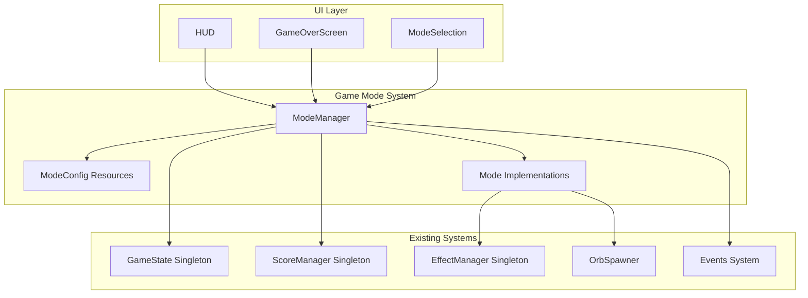
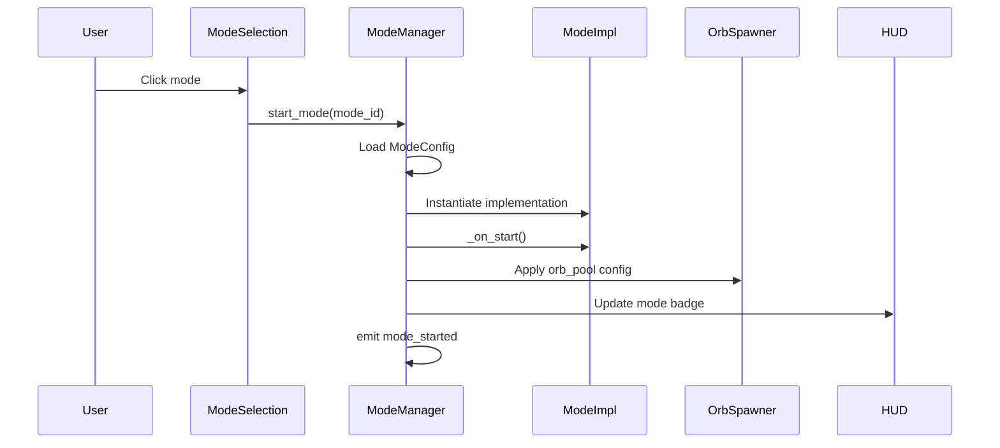
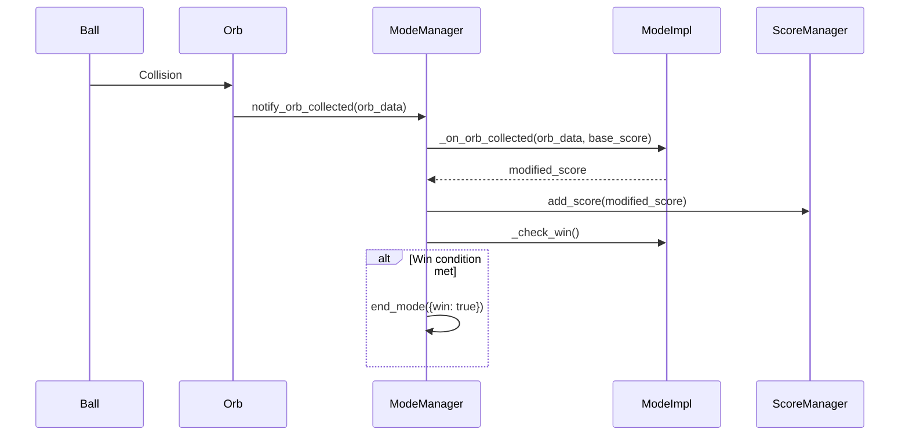
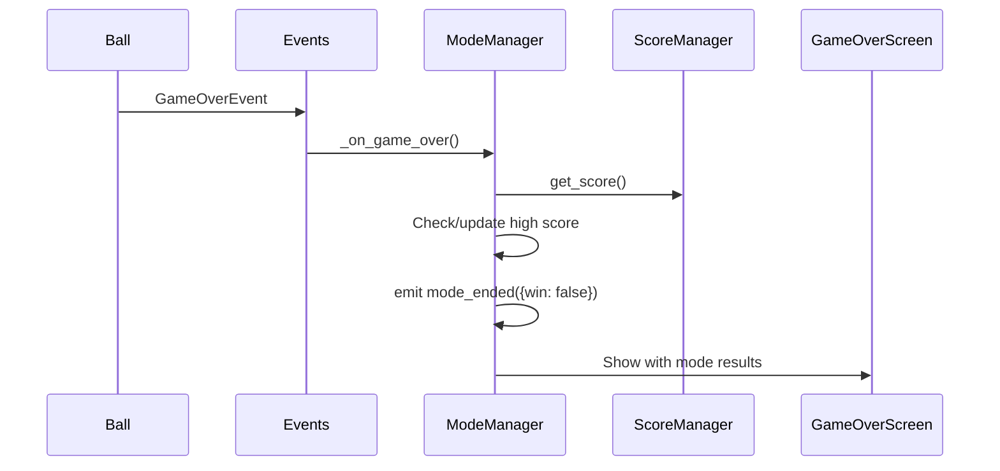

# Game Mode System - Detailed Design Document

## Overview

This document describes the architecture for a modular game mode system in "Don't Drop the Ball". The system enables easy addition of new game modes while preserving the core bounce mechanic and keeping the casual player experience simple.

### Goals
- Support multiple game modes with different win/lose conditions
- Maintain simple onboarding for casual players
- Enable mode-specific orb pools and scoring rules
- Provide extensible architecture for future modes
- Track separate high scores per mode

### Non-Goals
- Monetization or premium modes (out of scope for this phase)
- Online leaderboards
- Mode-specific player abilities or physics changes

---

## Detailed Requirements

### Functional Requirements

#### FR-1: Mode Selection
- Main menu displays "Quick Play" button (default: Classic Endless)
- Main menu displays "Select Mode" button that opens mode picker
- Mode picker shows all 4 modes with brief descriptions
- All modes are unlocked from the start

#### FR-2: Classic Endless Mode
- Gameplay continues until ball drops
- All orbs contribute to score
- Tracks high score per session and all-time

#### FR-3: Time Attack Mode
- Fixed 2-minute (120 second) time limit
- Gameplay ends when time expires (win) or ball drops (lose)
- Score based on total points collected
- Timer displayed prominently in HUD

#### FR-4: Orb Hunt Mode
- Target score must be reached from specific orb types only
- Non-target orbs may spawn but don't contribute to objective
- Win when target score reached, lose if ball drops
- Progress indicator shows % to target

#### FR-5: Survival Waves Mode
- Endless waves of increasing difficulty
- Advance to next wave by collecting X orbs
- Difficulty increases: faster spawns + more orbs required
- Score = highest wave reached
- Game over when ball drops

#### FR-6: High Score Persistence
- Each mode maintains separate high score
- High scores persist via existing save system
- High scores display in mode selection and game over screen

#### FR-7: Mode-Specific HUD
- Display mode badge/icon
- Display one key metric: timer, wave number, or progress %

### Technical Requirements

#### TR-1: Typed GDScript
- All new code uses typed variables and function signatures
- Follow existing code style conventions

#### TR-2: Minimal Changes
- Preserve existing core mechanics (ball physics, player controls)
- Keep diffs small and focused
- No reformatting of unrelated code

#### TR-3: Testability
- All deterministic logic must be unit testable
- Integration tests for mode transitions
- Validation via ./devscripts/test.sh

---

## Architecture Overview

### System Context



### Component Responsibilities

| Component | Responsibility |
|-----------|---------------|
| **ModeManager** | Singleton that orchestrates mode lifecycle, holds current mode state |
| **ModeConfig** | Resource defining mode properties (orb pool, win/lose conditions, UI hints) |
| **Mode Implementations** | Individual mode logic classes (EndlessMode, TimeAttackMode, etc.) |
| **ModeSelection UI** | Scene for selecting game modes |
| **HUD Extensions** | Mode-specific HUD elements |

---

## Components and Interfaces

### 1. ModeManager (Singleton)

**File:** `scripts/core/mode_manager.gd`

```gdscript
class_name ModeManager extends Node

## Emitted when a mode starts
signal mode_started(mode_id: String)

## Emitted when a mode ends with result
signal mode_ended(mode_id: String, result: Dictionary)

## Emitted when mode-specific metric changes
signal metric_updated(metric_name: String, value: Variant)

## Current active mode configuration
var current_mode: ModeConfig = null

## Current mode implementation
var _mode_impl: ModeBase = null

## All available mode configurations
var _available_modes: Dictionary = {}

func _ready() -> void:
    _load_mode_configs()
    Events.add_listener(GameOverEvent, _on_game_over)
    Events.add_listener(ReplayEvent, _on_replay)

## Start a mode by ID
func start_mode(mode_id: String) -> void

## End current mode with result
func end_mode(result: Dictionary) -> void

## Get high score for a mode
func get_high_score(mode_id: String) -> int

## Set high score for a mode
func set_high_score(mode_id: String, score: int) -> void

## Get current mode metric for HUD
func get_current_metric() -> Dictionary

## Check if current mode has win condition
func has_win_condition() -> bool

## Check win condition is met
func check_win_condition() -> bool
```

### 2. ModeConfig (Resource)

**File:** `scripts/data/mode_config.gd`

```gdscript
class_name ModeConfig extends Resource

## Unique identifier for this mode
@export var mode_id: String = ""

## Display name shown in UI
@export var display_name: String = ""

## Brief description for mode selection
@export var description: String = ""

## Icon for mode badge
@export var icon: Texture2D

## Mode implementation script path
@export var implementation: GDScript

## Orb data resources to spawn in this mode
@export var orb_pool: Array[OrbData] = []

## Spawn interval override (0 = use default)
@export var spawn_interval: float = 0.0

## Max orbs override (0 = use default)
@export var max_orbs: int = 0

## HUD metric to display
@export var hud_metric: String = "score"  # "score", "timer", "wave", "progress"

## Whether this mode has a win condition
@export var has_win: bool = false
```

### 3. ModeBase (Abstract)

**File:** `scripts/modes/mode_base.gd`

```gdscript
class_name ModeBase extends RefCounted

## Reference to mode configuration
var config: ModeConfig

## Called when mode starts
func _on_start() -> void:
    pass

## Called every physics frame during gameplay
func _on_process(delta: float) -> void:
    pass

## Called when an orb is collected
func _on_orb_collected(orb_data: OrbData, base_score: int) -> int:
    return base_score

## Called to check if win condition is met
func _check_win() -> bool:
    return false

## Called to check if lose condition is met (in addition to ball drop)
func _check_lose() -> bool:
    return false

## Called when mode ends
func _on_end() -> void:
    pass

## Get current metric for HUD display
func _get_metric() -> Dictionary:
    return {"name": "score", "value": 0, "max": 0}

## Get score for high score tracking
func _get_final_score() -> int:
    return ScoreManager.get_score()
```

### 4. Concrete Mode Implementations

#### EndlessMode
**File:** `scripts/modes/endless_mode.gd`

```gdscript
class_name EndlessMode extends ModeBase
## No win condition, lose on ball drop
## Metric: current score
```

#### TimeAttackMode
**File:** `scripts/modes/time_attack_mode.gd`

```gdscript
class_name TimeAttackMode extends ModeBase
## Win: survive 120 seconds
## Lose: ball drops before time
## Metric: remaining time (countdown)
```

#### OrbHuntMode
**File:** `scripts/modes/orb_hunt_mode.gd`

```gdscript
class_name OrbHuntMode extends ModeBase
## Win: reach target score from specific orbs
## Lose: ball drops
## Metric: progress percentage
```

#### SurvivalMode
**File:** `scripts/modes/survival_mode.gd`

```gdscript
class_name SurvivalMode extends ModeBase
## No win condition (endless waves)
## Lose: ball drops
## Metric: current wave number
```

---

## Data Models

### SavedGame Extension

**File:** `scripts/utils/saved_game.gd` (modify existing)

```gdscript
# Add to existing SavedGame class:
## High scores per mode: {"endless": 1000, "time_attack": 500, ...}
var mode_high_scores: Dictionary = {}
```

### Mode-Specific Configurations

Each mode will have a `.tres` resource file:

```
resources/modes/
├── endless_mode.tres
├── time_attack_mode.tres
├── orb_hunt_mode.tres
└── survival_mode.tres
```

---

## Data Flow

### Mode Start Flow



### Orb Collection Flow



### Game Over Flow



---

## Error Handling

### Mode Loading Errors
- If mode config fails to load, fallback to Classic Endless
- Log error with `push_error()`
- Show user-friendly message if critical

### Invalid Mode ID
- `start_mode()` validates mode exists before starting
- Returns early with warning if invalid

### Save/Load Errors
- Continue if high score save fails (non-blocking)
- Initialize empty `mode_high_scores` if corrupted

---

## Testing Strategy

### Unit Tests

| Test File | Coverage |
|-----------|----------|
| `test_mode_manager.gd` | Mode lifecycle, high score management |
| `test_mode_config.gd` | Config loading, validation |
| `test_endless_mode.gd` | Score tracking, no win condition |
| `test_time_attack_mode.gd` | Timer logic, win/lose conditions |
| `test_orb_hunt_mode.gd` | Target score tracking, progress |
| `test_survival_mode.gd` | Wave progression, difficulty scaling |

### Integration Tests

| Test File | Coverage |
|-----------|----------|
| `test_mode_orb_spawner.gd` | Mode-specific orb pool application |
| `test_mode_high_scores.gd` | Save/load of mode high scores |
| `test_mode_transitions.gd` | Mode start/end with game state |

### Manual Verification

| Mode | Verification Steps |
|------|-------------------|
| Classic Endless | Play until ball drops, verify score saved |
| Time Attack | Play for 2 min, verify win screen shows |
| Orb Hunt | Collect target orbs, verify win triggers |
| Survival | Advance 3+ waves, verify difficulty increase |

---

## Appendices

### A: Technology Choices

| Choice | Rationale |
|--------|-----------|
| Resource-based configs | Aligns with existing OrbData pattern, editor-friendly |
| Singleton ModeManager | Centralized state, easy access from any scene |
| Event-driven communication | Maintains loose coupling with existing systems |
| Inheritance for modes | Shared base behavior, mode-specific overrides |

### B: File Structure After Implementation

```
scripts/
├── core/
│   ├── game_state.gd (modified - may rename current_mode usage)
│   ├── score_manager.gd (unchanged)
│   └── mode_manager.gd (NEW)
├── data/
│   ├── orb_data.gd (unchanged)
│   ├── mode_config.gd (NEW)
│   └── behaviors/ (unchanged)
├── modes/
│   ├── mode_base.gd (NEW)
│   ├── endless_mode.gd (NEW)
│   ├── time_attack_mode.gd (NEW)
│   ├── orb_hunt_mode.gd (NEW)
│   └── survival_mode.gd (NEW)
├── utils/
│   └── saved_game.gd (modified - add mode_high_scores)
├── ball.gd (modified - extract game over trigger)
├── main_menu.gd (modified - add mode selection)
└── hud.gd (modified - add mode badge/metric)

scenes/
├── mode_selection.tscn (NEW)
└── hud.tscn (modified)

resources/
└── modes/
    ├── endless_mode.tres (NEW)
    ├── time_attack_mode.tres (NEW)
    ├── orb_hunt_mode.tres (NEW)
    └── survival_mode.tres (NEW)

tests/
├── unit/
│   ├── test_mode_manager.gd (NEW)
│   ├── test_mode_config.gd (NEW)
│   ├── test_endless_mode.gd (NEW)
│   ├── test_time_attack_mode.gd (NEW)
│   ├── test_orb_hunt_mode.gd (NEW)
│   └── test_survival_mode.gd (NEW)
└── integration/
    ├── test_mode_transitions.gd (NEW)
    └── test_mode_high_scores.gd (NEW)
```

### C: Risks and Mitigations

| Risk | Impact | Mitigation |
|------|--------|------------|
| Breaking existing gameplay | High | Extensive testing, incremental rollout |
| Performance with mode checks | Low | Mode checks are simple comparisons |
| Save file migration | Medium | Handle missing `mode_high_scores` gracefully |
| UI complexity | Medium | Keep HUD minimal, defer fancy animations |

### D: Alternative Approaches Considered

1. **Enum-based modes instead of Resource configs**
   - Simpler but less extensible
   - Rejected: Harder to add modes without code changes

2. **Mode logic in scenes instead of scripts**
   - Would duplicate scene files
   - Rejected: More maintenance overhead

3. **Global high score across modes**
   - Simpler save structure
   - Rejected: Unfair comparison between modes
