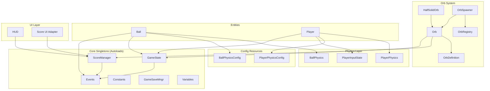
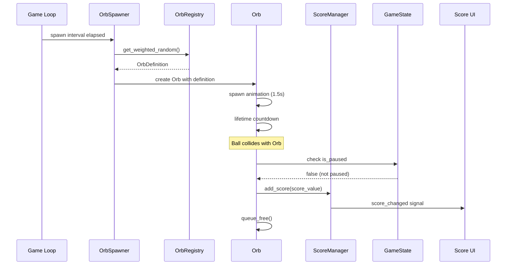

# Design Document: AI-Friendly Godot Game Refactor

## 1. Overview

### Problem Statement

The "Dont Drop" game codebase has accumulated technical debt that makes it difficult to:
- Test gameplay logic in isolation (requires scene instantiation)
- Add new orb types without duplicating code
- Reason about game state (scattered across static variables and events)
- Modify physics parameters without code changes

### Solution Summary

Refactor the codebase into a modular, testable architecture with:
1. **Core Singletons**: GameState and ScoreManager for centralized state
2. **Extracted Physics**: Pure static functions for ball and player physics
3. **Data-Driven Orbs**: Registry pattern with OrbDefinition resources
4. **Group-Based Collision**: Replace hardcoded name checks with groups

### Scope

**In Scope:**
- Core infrastructure (GameState, ScoreManager)
- Physics extraction (BallPhysics, PlayerPhysics)
- Orb system redesign (OrbDefinition, OrbRegistry, unified Orb class)
- Collision system modernization (groups)
- Test expansion

**Out of Scope:**
- Visual/audio changes
- UI redesign
- New gameplay features
- Save/load system changes

---

## 2. Detailed Requirements

### REQ-1: Game State Management

| ID | Requirement | Priority |
|----|-------------|----------|
| REQ-1.1 | GameState singleton must track `is_paused` (bool) | High |
| REQ-1.2 | GameState singleton must track `current_mode` (GameMode enum) | High |
| REQ-1.3 | `is_paused` changes must emit `pause_changed(is_paused: bool)` signal | High |
| REQ-1.4 | `current_mode` changes must emit `mode_changed(new_mode: GameMode)` signal | High |
| REQ-1.5 | `GameMode` enum must include: MENU, PLAYING, PAUSED, GAME_OVER | High |
| REQ-1.6 | Default mode must be `MENU` | High |
| REQ-1.7 | `reset()` must clear state to defaults | Medium |

### REQ-2: Score Management

| ID | Requirement | Priority |
|----|-------------|----------|
| REQ-2.1 | ScoreManager singleton must track current score | High |
| REQ-2.2 | ScoreManager singleton must track high score | High |
| REQ-2.3 | Score changes must emit `score_changed(new_score: int)` | High |
| REQ-2.4 | High score changes must emit `high_score_changed(new_high: int)` | High |
| REQ-2.5 | `add_score(amount: int)` must update both current and high score | High |
| REQ-2.6 | `reset_score()` must zero current score (not high score) | Medium |

### REQ-3: Physics Extraction

| ID | Requirement | Priority |
|----|-------------|----------|
| REQ-3.1 | BallPhysics must provide `clamp_max_speed()` static function | High |
| REQ-3.2 | BallPhysics must provide `clamp_fall_speed()` static function | High |
| REQ-3.3 | BallPhysics must provide `apply_air_friction()` static function | High |
| REQ-3.4 | BallPhysics must provide `process_velocity()` combining all effects | High |
| REQ-3.5 | PlayerPhysics must provide `can_coyote()` static function | High |
| REQ-3.6 | PlayerPhysics must provide `has_buffered_jump()` static function | High |
| REQ-3.7 | PlayerPhysics must provide `calculate_gravity()` static function | High |
| REQ-3.8 | PlayerPhysics must provide `calculate_horizontal_velocity()` static function | High |
| REQ-3.9 | Physics config resources must use `@export` for editor editing | Medium |

### REQ-4: Orb System

| ID | Requirement | Priority |
|----|-------------|----------|
| REQ-4.1 | OrbDefinition resource must define: type_name, display_name, score_value, lifespan, spawn_weight | High |
| REQ-4.2 | OrbRegistry must provide registration and lookup by type_name | High |
| REQ-4.3 | OrbRegistry must provide weighted random selection | High |
| REQ-4.4 | Unified Orb class must handle spawn animation, lifetime, collection | High |
| REQ-4.5 | HalfSolidOrb subclass must provide bounce-on-first-hit behavior | High |
| REQ-4.6 | OrbSpawner must use OrbRegistry for type selection | High |

### REQ-5: Collision System

| ID | Requirement | Priority |
|----|-------------|----------|
| REQ-5.1 | Ball must be in "ball" group | High |
| REQ-5.2 | Ground objects must be in "ground" group | High |
| REQ-5.3 | All collision checks must use `is_in_group()` instead of name comparison | High |

### REQ-6: Testing

| ID | Requirement | Priority |
|----|-------------|----------|
| REQ-6.1 | All new singletons must have unit tests | High |
| REQ-6.2 | All physics static functions must have unit tests | High |
| REQ-6.3 | OrbRegistry operations must have unit tests | High |
| REQ-6.4 | Integration tests must verify orb collection flow | Medium |
| REQ-6.5 | All tests must pass before task completion | High |

---

## 3. Architecture Overview

### System Architecture



### Data Flow



### Module Structure

```
scripts/
├── core/                    # NEW: Singletons
│   ├── game_state.gd        # GameState singleton
│   └── score_manager.gd     # ScoreManager singleton
├── systems/
│   ├── physics/             # NEW: Extracted physics
│   │   ├── ball_physics.gd
│   │   └── player_physics.gd
│   └── input/               # NEW: Input handling
│       └── player_input_state.gd
├── entities/
│   └── orb/                 # NEW: Unified orb system
│       ├── orb_definition.gd
│       ├── orb_registry.gd
│       ├── orb.gd
│       └── half_solid_orb.gd
├── data/                    # NEW: Config resources
│   ├── ball_physics_config.gd
│   └── player_physics_config.gd
├── events/                  # EXISTING: Event classes
├── utils/                   # EXISTING: Helpers
└── [existing entity scripts]
```

---

## 4. Components and Interfaces

### 4.1 GameState Singleton

**File:** `scripts/core/game_state.gd`

**Responsibility:** Centralized game state management with signal-based notifications.

**Interface:**
```gdscript
class_name GameState extends Node

# Signals
signal pause_changed(is_paused: bool)
signal mode_changed(new_mode: Enums.GameMode)

# Properties
var is_paused: bool  # Emits pause_changed on change
var current_mode: Enums.GameMode  # Emits mode_changed on change

# Methods
func toggle_pause() -> void
func reset() -> void
```

**Dependencies:**
- `Enums.GameMode` (to be added to `scripts/utils/enums.gd`)

### 4.2 ScoreManager Singleton

**File:** `scripts/core/score_manager.gd`

**Responsibility:** Score tracking with signal-based UI updates.

**Interface:**
```gdscript
class_name ScoreManager extends Node

# Signals
signal score_changed(new_score: int)
signal high_score_changed(new_high: int)

# Methods
func get_score() -> int
func get_high_score() -> int
func add_score(amount: int) -> int  # Returns new score
func reset_score() -> void
func set_high_score(value: int) -> void
```

**Dependencies:** None

### 4.3 BallPhysics Static Class

**File:** `scripts/systems/physics/ball_physics.gd`

**Responsibility:** Pure ball physics calculations, testable without scene.

**Interface:**
```gdscript
class_name BallPhysics

static func clamp_max_speed(velocity: Vector2, max_speed: float) -> Vector2
static func clamp_fall_speed(velocity: Vector2, max_fall_speed: float) -> Vector2
static func apply_air_friction(velocity: Vector2, friction: float) -> Vector2
static func process_velocity(velocity: Vector2, config: BallPhysicsConfig) -> Vector2
```

**Dependencies:**
- `BallPhysicsConfig` resource

### 4.4 PlayerPhysics Static Class

**File:** `scripts/systems/physics/player_physics.gd`

**Responsibility:** Pure player physics calculations (coyote time, buffered jump, gravity).

**Interface:**
```gdscript
class_name PlayerPhysics

static func can_coyote(time_left_ground: int, current_time: int, timeout_ms: float) -> bool
static func has_buffered_jump(time_pressed: int, current_time: int, timeout_ms: float) -> bool
static func calculate_gravity(
    current_velocity_y: float,
    is_grounded: bool,
    ended_jump_early: bool,
    config: PlayerPhysicsConfig,
    delta: float
) -> float
static func calculate_horizontal_velocity(
    current: float,
    direction: float,
    target_speed: float,
    config: PlayerPhysicsConfig,
    delta: float
) -> float
```

**Dependencies:**
- `PlayerPhysicsConfig` resource

### 4.5 PlayerInputState Class

**File:** `scripts/systems/input/player_input_state.gd`

**Responsibility:** Track and process input state for player movement.

**Interface:**
```gdscript
class_name PlayerInputState

var move_direction: float  # -1.0 to 1.0
var jump_held: bool
var jump_just_pressed: bool
var last_jump_time: int

func process_input(event: InputEvent) -> void
func reset() -> void
```

### 4.6 OrbDefinition Resource

**File:** `scripts/entities/orb/orb_definition.gd`

**Responsibility:** Data container for orb type configuration.

**Interface:**
```gdscript
class_name OrbDefinition extends Resource

@export var type_name: StringName
@export var display_name: String
@export var score_value: int = 1
@export var lifespan_seconds: float = 30.0
@export var scene: PackedScene
@export var sprite_texture: Texture2D
@export var has_physics_body: bool = false
@export_category("Spawn Settings")
@export var spawn_weight: float = 1.0
```

### 4.7 OrbRegistry Static Class

**File:** `scripts/entities/orb/orb_registry.gd`

**Responsibility:** Centralized orb type registration and weighted selection.

**Interface:**
```gdscript
class_name OrbRegistry

static func initialize() -> void
static func register(def: OrbDefinition) -> void
static func get_definition(type_name: StringName) -> OrbDefinition
static func get_all_definitions() -> Array
static func get_weighted_random() -> OrbDefinition
```

### 4.8 Orb Base Class

**File:** `scripts/entities/orb/orb.gd`

**Responsibility:** Unified orb behavior (spawn, lifetime, collection).

**Interface:**
```gdscript
class_name Orb extends Node2D

signal collected

@export var definition: OrbDefinition

func collect() -> void
func _on_body_entered(body: Node2D) -> void
```

### 4.9 HalfSolidOrb Subclass

**File:** `scripts/entities/orb/half_solid_orb.gd`

**Responsibility:** Orb that bounces ball on first collision, collects on second.

**Interface:**
```gdscript
class_name HalfSolidOrb extends Orb

func _on_ball_collision(ball: Node2D) -> void
```

---

## 5. Data Models

### GameMode Enum

**File:** `scripts/utils/enums.gd` (append)

```gdscript
enum GameMode {
    MENU,       # Main menu, settings, tutorial screens
    PLAYING,    # Active gameplay (ball in play)
    PAUSED,     # Pause screen overlay active
    GAME_OVER   # Game ended (ball hit ground)
}
```

### BallPhysicsConfig Resource

**File:** `scripts/data/ball_physics_config.gd`

| Field | Type | Default | Description |
|-------|------|---------|-------------|
| max_speed | float | 900.0 | Maximum total velocity |
| max_fall_speed | float | 500.0 | Maximum downward velocity |
| air_friction | float | 9.0 | Horizontal deceleration factor |

### PlayerPhysicsConfig Resource

**File:** `scripts/data/player_physics_config.gd`

| Field | Type | Default | Description |
|-------|------|---------|-------------|
| jump_power | int | -700 | Initial jump velocity |
| move_speed | int | 120 | Target horizontal speed |
| acceleration | float | 1500.0 | Speed increase rate |
| initial_acceleration | float | 2000.0 | Initial speed increase |
| deceleration | float | 10000.0 | Speed decrease rate |
| coyote_timeout | float | 150.0 | ms after leaving ground |
| jump_buffer_timeout | float | 150.0 | ms before landing |
| fall_acceleration | float | 1800.0 | Gravity strength |
| max_fall_speed | float | 800.0 | Terminal velocity |
| grounding_force | float | 1.5 | Snap-to-ground force |
| early_jump_gravity_modifier | float | 3.0 | Early jump cutoff |

---

## 6. Error Handling

### Validation Strategy

| Component | Validation | Recovery |
|-----------|------------|----------|
| GameState | None needed | State always valid |
| ScoreManager | None needed | Score always >= 0 |
| BallPhysics | `max_speed <= 0` means no clamping | Skip clamping |
| PlayerPhysics | Config values validated | Use safe defaults |
| OrbDefinition | Required fields checked at runtime | `push_error()` and skip |
| OrbRegistry | Unknown type_name lookup | `push_warning()` return null |

### Error Types

1. **Missing OrbDefinition**: Orb created without definition
   - Detection: `if definition == null` in `_ready()`
   - Recovery: `push_error()` and return early

2. **Unknown Orb Type**: Registry lookup for unregistered type
   - Detection: `if not _definitions.has(type_name)`
   - Recovery: `push_warning()` return null

3. **Invalid Physics Config**: Zero/negative values
   - Detection: In static functions (e.g., `if max_speed > 0`)
   - Recovery: Skip that operation (pass through velocity)

---

## 7. Testing Strategy

### Unit Tests (No Scene Instantiation)

| Test File | Coverage |
|-----------|----------|
| `test_game_state.gd` | Initial state, signal emission, toggle, reset |
| `test_score_manager.gd` | Add, reset, high score, signals |
| `test_ball_physics.gd` | All clamp functions, process_velocity |
| `test_player_physics.gd` | Coyote, buffer, gravity, horizontal |
| `test_player_input_state.gd` | Direction, jump state, reset |
| `test_orb_definition.gd` | Defaults, custom values |
| `test_orb_registry.gd` | Register, lookup, weighted random |

### Integration Tests (With Scene Components)

| Test File | Coverage |
|-----------|----------|
| `test_orb_collection_integration.gd` | Spawn orb, collect, verify score |
| `test_pause_integration.gd` | Pause mid-game, verify state frozen |
| `test_game_loop.gd` | Start → play → game over |

### Test Execution

```bash
# Run all tests
./devscripts/test.sh

# Must exit 0 for completion
```

### Coverage Goals

- New singletons: 100% method coverage
- Physics classes: 100% static function coverage
- Orb system: All public methods

---

## 8. Appendices

### A. Technology Choices

| Choice | Pros | Cons | Decision |
|--------|------|------|----------|
| Static physics classes | Testable, no instantiation | No inheritance | **Chosen**: Simplicity |
| Resources for config | Editor-editable, reusable | More files | **Chosen**: Data-driven |
| Registry pattern | Extensible, centralized | Global state | **Chosen**: Singletons already used |
| Groups for collision | Decoupled, flexible | Requires scene updates | **Chosen**: Best practice |

### B. Alternative Approaches Considered

1. **Component-based entities**: Rejected - over-engineering for current scope
2. **Dependency injection**: Rejected - Godot uses singletons idiomatically
3. **Full ECS refactor**: Rejected - preserves existing gameplay behavior takes priority

### C. Key Constraints

1. **Preserve Gameplay**: All current mechanics must work identically after refactor
2. **Godot 4.x**: Use Godot 4 patterns (typed GDScript, signals)
3. **Headless Testing**: All tests must pass without editor
4. **No Binary Formats**: Use .tscn/.tres, not .scn/.res

### D. Migration Path

The 20-step plan provides a safe migration path:
1. Add new systems alongside existing code
2. Migrate one component at a time
3. Verify tests at each step
4. Remove old code only after verification

### E. Extension Points

The refactored architecture enables:
- **New orb types**: Add `OrbDefinition` to registry
- **Physics variants**: Create new config resources
- **Game modes**: Use `GameState.current_mode`
- **Custom behaviors**: Extend `Orb` class
