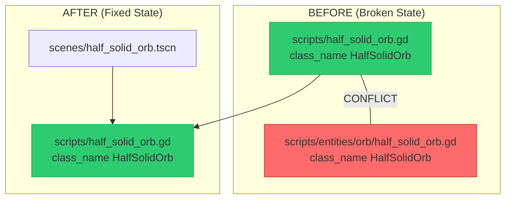

# Design: Fix Incomplete Orb System Migration

## Overview

**Problem:** Duplicate `class_name HalfSolidOrb` declarations in two files cause GDScript parser errors, preventing the game from running.

**Solution:** Delete the unused new orb system files to restore the game to a working state with the original orb implementation.

## Architecture Overview



## Detailed Requirements

| ID | Requirement | Priority |
|----|-------------|----------|
| R1 | Delete all files in `scripts/entities/orb/` directory | Critical |
| R2 | Delete test files for the new orb system | Critical |
| R3 | Remove `scripts/entities/` directory if empty | Medium |
| R4 | Verify no GDScript errors on project load | Critical |
| R5 | Verify all tests pass via `./devscripts/test.sh` | Critical |

## Components and Interfaces

### Files to Delete

| File | Reason |
|------|--------|
| `scripts/entities/orb/orb.gd` | Base class for unused orb system |
| `scripts/entities/orb/orb_definition.gd` | Resource definition for unused orb system |
| `scripts/entities/orb/orb_registry.gd` | Registry for unused orb system |
| `scripts/entities/orb/half_solid_orb.gd` | **Causes class_name conflict** |
| `tests/unit/test_orb.gd` | Tests for deleted base class |
| `tests/unit/test_half_solid_orb.gd` | Tests for deleted subclass |
| `tests/unit/test_orb_definition.gd` | Tests for deleted resource |
| `tests/unit/test_orb_registry.gd` | Tests for deleted registry |
| `tests/integration/test_orb_collection_integration.gd` | Integration tests for deleted system |

### Files to Preserve

| File | Reason |
|------|--------|
| `scripts/half_solid_orb.gd` | Original, working implementation |
| `scripts/blue_orb.gd` | Active game component |
| `scripts/red_orb.gd` | Active game component |
| `scripts/generic_orb.gd` | Active game component |
| `scenes/half_solid_orb.tscn` | Scene using original implementation |
| `tests/unit/test_orb_scoring.gd` | Existing working tests |
| `tests/unit/test_orb_properties.gd` | Existing working tests |

## Implementation Steps

1. **Delete source files**
   ```bash
   rm scripts/entities/orb/orb.gd
   rm scripts/entities/orb/orb_definition.gd
   rm scripts/entities/orb/orb_registry.gd
   rm scripts/entities/orb/half_solid_orb.gd
   rmdir scripts/entities/orb
   rmdir scripts/entities  # if empty
   ```

2. **Delete test files** (check existence first)
   ```bash
   rm -f tests/unit/test_orb.gd
   rm -f tests/unit/test_half_solid_orb.gd
   rm -f tests/unit/test_orb_definition.gd
   rm -f tests/unit/test_orb_registry.gd
   rm -f tests/integration/test_orb_collection_integration.gd
   ```

3. **Verify**
   ```bash
   ./devscripts/test.sh
   ```

4. **Smoke test** - Launch game and verify basic gameplay

## Error Handling

| Error | Recovery |
|-------|----------|
| File doesn't exist | Skip silently (expected for optional test files) |
| Directory not empty after `rmdir` | Leave directory, log warning |
| Test failure | Investigate, do not proceed to smoke test |
| GDScript error on load | Investigate remaining references to deleted files |

## Testing Strategy

1. **Automated:** Run `./devscripts/test.sh` - must exit with code 0
2. **Manual:** Launch game via Godot editor - must load without errors
3. **Gameplay:** Play one round - orbs must spawn and interact correctly

## Constraints and Limitations

- **No refactoring:** This fix only removes conflicting files; the original orb implementation remains unchanged
- **No improvements:** Do not attempt to clean up or improve the remaining code
- **Future migration:** If a unified orb system is desired later, it must be planned as a separate task with proper scene file updates
