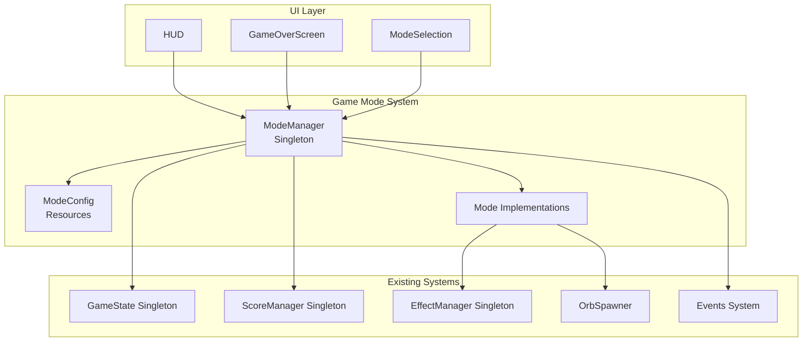
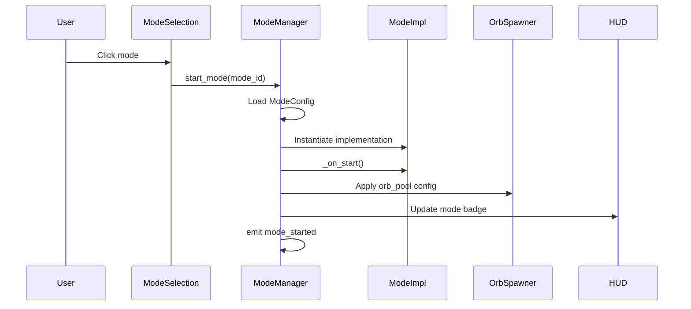
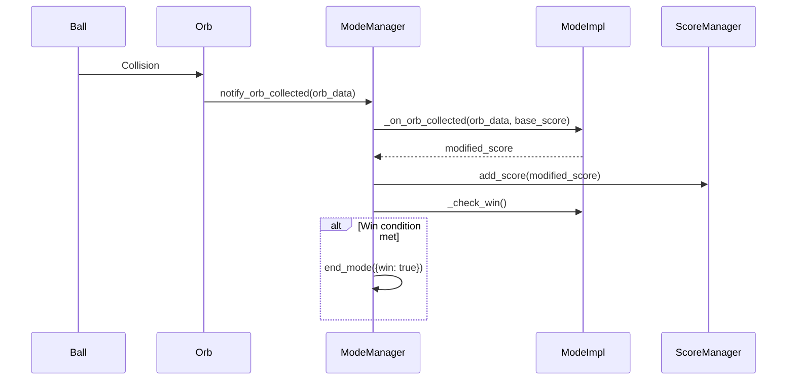
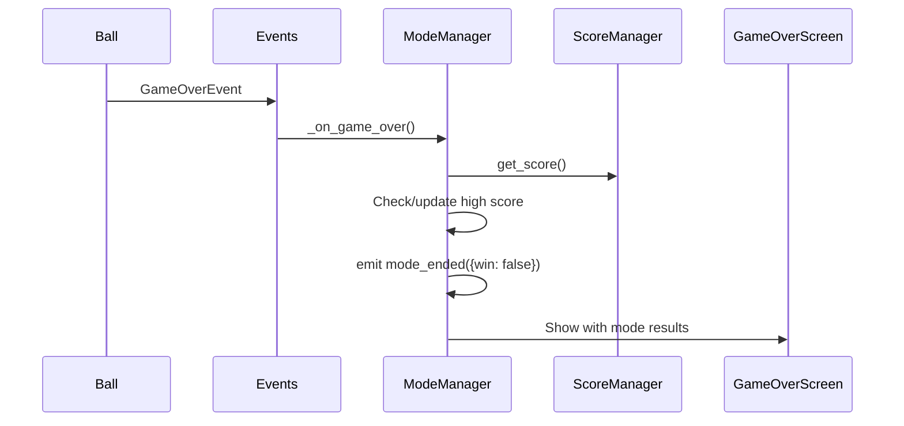

# Game Mode System - Design Document

## 1. Overview

### Problem Statement
"Don't Drop the Ball" currently has a single endless mode. Players want variety without complexity, and we want an extensible architecture for future modes.

### Solution Summary
A modular game mode system using Resource-based configurations and a centralized ModeManager singleton. Each mode implements ModeBase with hooks for orb collection, win/lose checking, and HUD metrics.

---

## 2. Architecture Overview



---

## 3. Components and Interfaces

### 3.1 ModeManager (Singleton)

**File:** `scripts/core/mode_manager.gd`

**Responsibility:** Orchestrates mode lifecycle, holds current mode state, manages high scores.

```gdscript
class_name ModeManager extends Node

signal mode_started(mode_id: String)
signal mode_ended(mode_id: String, result: Dictionary)
signal metric_updated(metric_name: String, value: Variant)

var current_mode: ModeConfig = null
var _mode_impl: ModeBase = null
var _available_modes: Dictionary = {}

func start_mode(mode_id: String) -> void
func end_mode(result: Dictionary) -> void
func get_high_score(mode_id: String) -> int
func set_high_score(mode_id: String, score: int) -> void
func get_current_metric() -> Dictionary
```

### 3.2 ModeConfig (Resource)

**File:** `scripts/data/mode_config.gd`

**Responsibility:** Defines mode properties for editor configuration.

```gdscript
class_name ModeConfig extends Resource

@export var mode_id: String = ""
@export var display_name: String = ""
@export var description: String = ""
@export var icon: Texture2D
@export var implementation: GDScript
@export var orb_pool: Array[OrbData] = []
@export var spawn_interval: float = 0.0
@export var max_orbs: int = 0
@export var hud_metric: String = "score"
@export var has_win: bool = false
```

### 3.3 ModeBase (Abstract)

**File:** `scripts/modes/mode_base.gd`

**Responsibility:** Abstract base class with lifecycle hooks for mode implementations.

```gdscript
class_name ModeBase extends RefCounted

var config: ModeConfig

func _on_start() -> void
func _on_process(delta: float) -> void
func _on_orb_collected(orb_data: OrbData, base_score: int) -> int
func _check_win() -> bool
func _check_lose() -> bool
func _on_end() -> void
func _get_metric() -> Dictionary
func _get_final_score() -> int
```

### 3.4 Concrete Mode Implementations

| Mode | File | Win Condition | Metric |
|------|------|---------------|--------|
| EndlessMode | `scripts/modes/endless_mode.gd` | None | score |
| TimeAttackMode | `scripts/modes/time_attack_mode.gd` | Time expires | timer countdown |
| OrbHuntMode | `scripts/modes/orb_hunt_mode.gd` | Target score reached | progress % |
| SurvivalMode | `scripts/modes/survival_mode.gd` | None (endless) | wave number |

---

## 4. Data Models

### 4.1 SavedGame Extension

Modify `scripts/utils/saved_game.gd`:

```gdscript
# Add to existing class:
var mode_high_scores: Dictionary = {}
```

### 4.2 Mode Resources Structure

```
resources/modes/
├── endless_mode.tres
├── time_attack_mode.tres
├── orb_hunt_mode.tres
└── survival_mode.tres
```

---

## 5. Data Flow

### 5.1 Mode Start Flow



### 5.2 Orb Collection Flow



### 5.3 Game Over Flow



---

## 6. Error Handling

| Error Scenario | Handling |
|----------------|----------|
| Mode config fails to load | Fallback to Classic Endless, log error |
| Invalid mode ID | Return early with warning |
| Save/load high score fails | Continue non-blocking, initialize empty dict |
| Missing mode_high_scores in save | Initialize empty dict |

---

## 7. Testing Strategy

### 7.1 Unit Tests

| Test File | Coverage |
|-----------|----------|
| `test_mode_manager.gd` | Mode lifecycle, high score management |
| `test_mode_config.gd` | Config loading, validation |
| `test_endless_mode.gd` | Score tracking, no win condition |
| `test_time_attack_mode.gd` | Timer logic, win/lose conditions |
| `test_orb_hunt_mode.gd` | Target score tracking, progress |
| `test_survival_mode.gd` | Wave progression, difficulty scaling |

### 7.2 Integration Tests

| Test File | Coverage |
|-----------|----------|
| `test_mode_transitions.gd` | Mode start/end with game state |
| `test_mode_orb_spawner.gd` | Mode-specific orb pool application |
| `test_mode_high_scores.gd` | Save/load of mode high scores |

---

## 8. File Structure After Implementation

```
scripts/
├── core/
│   └── mode_manager.gd (NEW)
├── data/
│   └── mode_config.gd (NEW)
├── modes/
│   ├── mode_base.gd (NEW)
│   ├── endless_mode.gd (NEW)
│   ├── time_attack_mode.gd (NEW)
│   ├── orb_hunt_mode.gd (NEW)
│   └── survival_mode.gd (NEW)
├── utils/
│   └── saved_game.gd (MODIFIED)
├── ball.gd (MODIFIED)
├── main_menu.gd (MODIFIED)
└── hud.gd (MODIFIED)

scenes/
├── mode_selection.tscn (NEW)
└── hud.tscn (MODIFIED)

resources/modes/ (NEW)
├── endless_mode.tres
├── time_attack_mode.tres
├── orb_hunt_mode.tres
└── survival_mode.tres
```

---

## 9. Implementation Phases

| Phase | Steps | Description |
|-------|-------|-------------|
| Foundation | 1-3 | Data structures, ModeManager, ModeBase |
| Integration | 4-5 | Connect to game flow, add mode selection UI |
| Modes | 6-8 | Implement Time Attack, Orb Hunt, Survival |
| Features | 9-11 | Orb pools, high scores, HUD |
| Polish | 12 | Final testing and verification |

---

## 10. Appendices

### A: Technology Choices

| Choice | Rationale |
|--------|-----------|
| Resource-based configs | Aligns with existing OrbData pattern, editor-friendly |
| Singleton ModeManager | Centralized state, easy access from any scene |
| Event-driven communication | Maintains loose coupling with existing systems |
| Inheritance for modes | Shared base behavior, mode-specific overrides |

### B: Risks and Mitigations

| Risk | Impact | Mitigation |
|------|--------|------------|
| Breaking existing gameplay | High | Extensive integration tests in Step 4 |
| Performance with mode checks | Low | Mode checks are simple comparisons |
| Save file migration | Medium | Handle missing mode_high_scores gracefully |
| UI complexity | Medium | Keep HUD minimal, defer animations |
