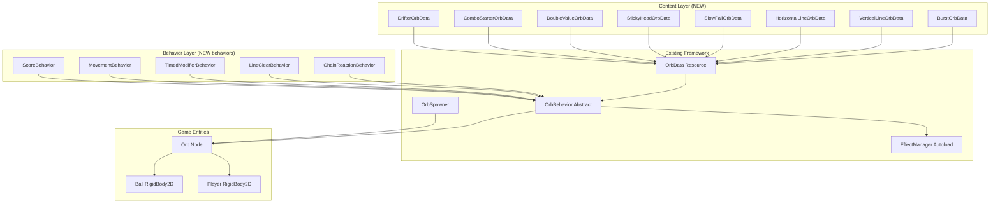
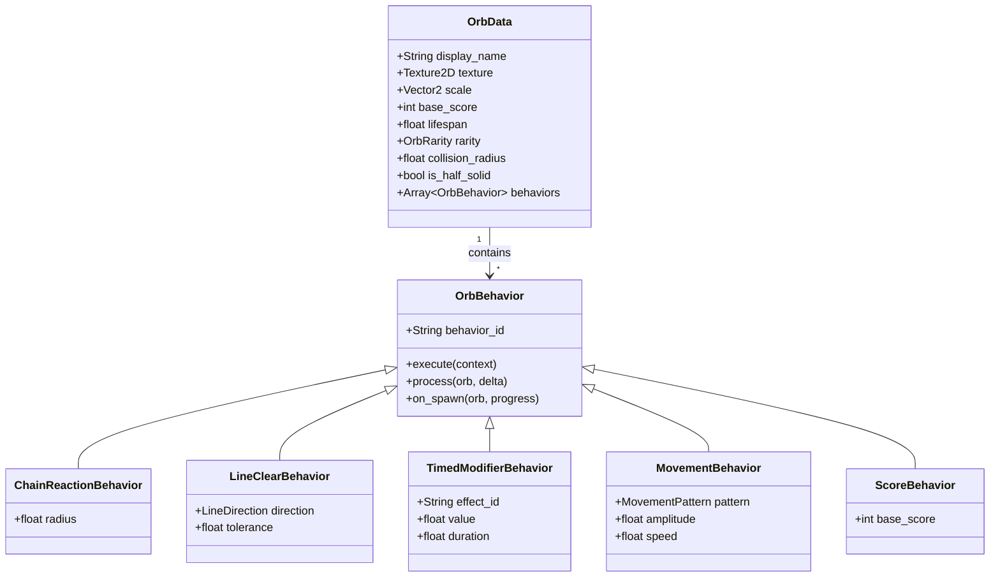

# Orb Content Pack - Design Document

## 1. Overview

### Problem Statement
Implement 8 new playable orb types on top of the existing orb/effect system. This is a content implementation task, NOT an architecture task. The goal is to create actual playable orb content using the already-built OrbData/OrbBehavior/EffectManager systems.

### Solution Summary
Create concrete OrbBehavior implementations and OrbData resources for each new orb type, then integrate them into the spawning system. Leverage existing EffectManager for timed effects and implement new behaviors only where needed (chain reaction, line clear, movement, sticky head).

---

## 2. Detailed Requirements

### REQ-1: Sticky Head Orb
**Source:** Q1/A1, Q4/A4

| Property | Value |
|----------|-------|
| Behavior Type | Collision dampening |
| Duration | 15-20 seconds (configurable) |
| Effect ID | `sticky_head` |
| Effect Value | 0.5 (50% bounce velocity) |
| Trigger | On player collision (via `_on_body_entered`) |
| Mechanism | Reduces ball's vertical velocity when bouncing off player |
| Stacking | Replace (single instance) |

### REQ-2: Drifter Orb
**Source:** Q2/A2

| Property | Value |
|----------|-------|
| Movement Pattern | Horizontal oscillation (sine wave) |
| Formula | `position.x = initial_x + sin(time * speed) * amplitude` |
| Amplitude | 50-100 pixels (configurable) |
| Speed | 1-2 cycles/second (configurable) |
| Behavior Type | MovementBehavior using `process()` |

### REQ-3: Line Orbs (Vertical/Horizontal)
**Source:** Q3/A3

| Property | Value |
|----------|-------|
| Line Definition | Coordinate tolerance matching |
| Tolerance | 20 pixels (configurable) |
| Range | Full scene (all matching orbs) |
| Max Orbs Cleared | No limit |
| Visual Effect | None (MVP) |
| Self Consumed | YES |

**Matching Logic:**
- **Vertical Line**: Clear orbs where `abs(orb.x - source.x) < tolerance`
- **Horizontal Line**: Clear orbs where `abs(orb.y - source.y) < tolerance`

### REQ-4: Burst Orb
**Source:** Design Decision

| Property | Value |
|----------|-------|
| Detection Method | Distance from source orb position |
| Radius | 150 pixels (configurable) |
| Max Orbs Cleared | No limit |
| Self Consumed | YES |
| Chain Reaction | All orbs within radius are collected |

### Existing Effects (Already in EffectManager)

| Effect ID | Stack Behavior | Duration | Cap |
|-----------|----------------|----------|-----|
| `slow_fall` | Multiplicative floor | 45s | 0.1 |
| `double_value` | Single instance | Until used | N/A |
| `combo_chain` | Increment | 10s | None |
| `score_multiplier` | Multiplicative ceiling | 45s | 10x |
| `time_slow` | Multiplicative floor | 10s | 0.25x |

---

## 3. Architecture Overview



---

## 4. Components and Interfaces

### 4.1 ChainReactionBehavior
**File:** `scripts/data/behaviors/chain_reaction_behavior.gd`

```gdscript
class_name ChainReactionBehavior extends OrbBehavior

@export var radius: float = 150.0

func execute(context: Dictionary) -> void:
    var source_orb: Node = context.get("orb")
    var all_orbs: Array = source_orb.get_tree().get_nodes_in_group("orbs")

    for orb in all_orbs:
        if orb == source_orb:
            continue
        if orb.global_position.distance_to(source_orb.global_position) <= radius:
            # Trigger collection on nearby orb
            if orb.has_method("collect"):
                orb.collect()
```

### 4.2 LineClearBehavior
**File:** `scripts/data/behaviors/line_clear_behavior.gd`

```gdscript
class_name LineClearBehavior extends OrbBehavior
enum LineDirection { VERTICAL, HORIZONTAL }

@export var direction: LineDirection = LineDirection.VERTICAL
@export var tolerance: float = 20.0

func execute(context: Dictionary) -> void:
    var source_orb: Node = context.get("orb")
    var all_orbs: Array = source_orb.get_tree().get_nodes_in_group("orbs")
    var source_pos: Vector2 = source_orb.global_position

    for orb in all_orbs:
        if orb == source_orb:
            continue
        var orb_pos: Vector2 = orb.global_position
        var matches: bool = false

        match direction:
            LineDirection.VERTICAL:
                matches = abs(orb_pos.x - source_pos.x) < tolerance
            LineDirection.HORIZONTAL:
                matches = abs(orb_pos.y - source_pos.y) < tolerance

        if matches and orb.has_method("collect"):
            orb.collect()
```

### 4.3 TimedModifierBehavior
**File:** `scripts/data/behaviors/timed_modifier_behavior.gd`

```gdscript
class_name TimedModifierBehavior extends OrbBehavior

@export var effect_id: String = ""
@export var value: float = 1.0
@export var duration: float = 10.0

func execute(context: Dictionary) -> void:
    if effect_id.is_empty():
        return
    EffectManager.apply_effect(effect_id, value, duration, context.get("orb"))
```

### 4.4 MovementBehavior
**File:** `scripts/data/behaviors/movement_behavior.gd`

```gdscript
class_name MovementBehavior extends OrbBehavior
enum MovementPattern { HORIZONTAL_OSCILLATE, VERTICAL_OSCILLATE }

@export var pattern: MovementPattern = MovementPattern.HORIZONTAL_OSCILLATE
@export var amplitude: float = 75.0
@export var speed: float = 2.0  # cycles per second

var _initial_position: Vector2 = Vector2.ZERO
var _time_elapsed: float = 0.0
var _initialized: bool = false

func process(orb: Node, delta: float) -> void:
    if not _initialized:
        _initial_position = orb.global_position
        _initialized = true

    _time_elapsed += delta

    match pattern:
        MovementPattern.HORIZONTAL_OSCILLATE:
            var offset: float = sin(_time_elapsed * speed * TAU) * amplitude
            orb.global_position.x = _initial_position.x + offset
        MovementPattern.VERTICAL_OSCILLATE:
            var offset: float = sin(_time_elapsed * speed * TAU) * amplitude
            orb.global_position.y = _initial_position.y + offset
```

### 4.5 ScoreBehavior
**File:** `scripts/data/behaviors/score_behavior.gd`

```gdscript
class_name ScoreBehavior extends OrbBehavior

@export var base_score: int = 1

func execute(context: Dictionary) -> void:
    var orb_data: OrbData = context.get("orb_data")
    var score: int = base_score

    # Apply double value if active
    if EffectManager.has_effect("double_value"):
        score *= 2

    # Apply score multiplier if active
    var multiplier: Variant = EffectManager.get_effect_value("score_multiplier")
    if multiplier != null:
        score = int(score * float(multiplier))

    ScoreManager.add_score(score)
```

### 4.6 StickyHeadBehavior (NEW Effect)
**File:** `scripts/data/behaviors/sticky_head_behavior.gd`

```gdscript
class_name StickyHeadBehavior extends OrbBehavior

@export var damping_factor: float = 0.5  # 50% bounce velocity
@export var duration: float = 15.0  # 15-20 seconds

func execute(context: Dictionary) -> void:
    EffectManager.apply_effect("sticky_head", damping_factor, duration, context.get("orb"))
```

This requires updating the Ball to check for `sticky_head` effect **on player collision**:

```gdscript
# In ball.gd _on_body_entered(body):
func _on_body_entered(body: Node) -> void:
    # ... existing collision handling ...

    # Apply sticky head dampening on player collision
    if body.is_in_group("player") and EffectManager.has_effect("sticky_head"):
        var damping: float = EffectManager.get_effect_value("sticky_head")
        linear_velocity.y *= damping  # e.g., 0.5 = 50% slower bounce
```

**CRITICAL:** Dampening applies only on player collision, NOT every frame. This preserves the bounce mechanic while giving the player more control.

---

## 5. Data Models

### 5.1 OrbData Resource Files

Each orb type is defined as a `.tres` resource file:

```
resources/orbs/
├── burst_orb.tres
├── vertical_line_orb.tres
├── horizontal_line_orb.tres
├── slow_fall_orb.tres
├── sticky_head_orb.tres
├── double_value_orb.tres
├── combo_starter_orb.tres
└── drifter_orb.tres
```

### 5.2 Orb Definitions



---

## 6. Orb Pack Specification

| # | Orb Name | Rarity | Score | Behaviors | Notes |
|---|----------|--------|-------|-----------|-------|
| 1 | Burst Orb | RARE | 8 | ScoreBehavior(8), ChainReactionBehavior(150) | Clears nearby orbs |
| 2 | Vertical Line Orb | RARE | 5 | ScoreBehavior(5), LineClearBehavior(VERTICAL, 20) | Clears vertical line |
| 3 | Horizontal Line Orb | RARE | 5 | ScoreBehavior(5), LineClearBehavior(HORIZONTAL, 20) | Clears horizontal line |
| 4 | Slow Fall Orb | UNCOMMON | 2 | ScoreBehavior(2), TimedModifierBehavior("slow_fall", 0.5, 45) | Uses existing effect |
| 5 | Sticky Head Orb | UNCOMMON | 3 | ScoreBehavior(3), StickyHeadBehavior(0.5, 15.0) | Collision dampening |
| 6 | Double Value Orb | UNCOMMON | 1 | ScoreBehavior(1), TimedModifierBehavior("double_value", 1, -1) | Uses existing effect |
| 7 | Combo Starter Orb | RARE | 3 | ScoreBehavior(3), TimedModifierBehavior("combo_chain", 1, 10) | Uses existing effect |
| 8 | Drifter Orb | UNCOMMON | 2 | ScoreBehavior(2), MovementBehavior(HORIZONTAL, 75, 2) | Moving target |

---

## 7. Implementation Sequence

```mermaid
flowchart LR
    subgraph Phase1[Phase 1: Core Behaviors]
        A1[ScoreBehavior]
        A2[TimedModifierBehavior]
    end

    subgraph Phase2[Phase 2: Area Effects]
        B1[ChainReactionBehavior]
        B2[LineClearBehavior]
    end

    subgraph Phase3[Phase 3: Movement & New Effect]
        C1[MovementBehavior]
        C2[StickyHeadBehavior]
        C3[Update Ball for sticky_head]
    end

    subgraph Phase4[Phase 4: Orb Data Resources]
        D1[Create 8 .tres files]
        D2[Update spawn table]
    end

    subgraph Phase5[Phase 5: Testing]
        E1[Unit tests]
        E2[Integration tests]
        E3[Manual verification]
    end

    Phase1 --> Phase2
    Phase2 --> Phase3
    Phase3 --> Phase4
    Phase4 --> Phase5
```



---

## 8. Error Handling

### 8.1 Behavior Errors
| Error | Recovery |
|-------|----------|
| Missing context dictionary | Log warning, skip behavior |
| Null orb reference | Log warning, skip behavior |
| Invalid effect_id | Log warning, skip application |

### 8.2 Chain Reaction Edge Cases
| Case | Handling |
|------|----------|
| No orbs in radius | No-op (source orb still collected) |
| Source orb not in tree | Skip processing |
| Target orb already queued for deletion | Skip that orb |

### 8.3 Line Clear Edge Cases
| Case | Handling |
|------|----------|
| No orbs on line | No-op (source orb still collected) |
| Only source orb matches | No additional clears |
| Orbs at exact same coordinate | All cleared |

---

## 9. Testing Strategy

### 9.1 Unit Tests

| Test File | Tests |
|-----------|-------|
| `test_chain_reaction_behavior.gd` | Radius detection, exclude self, empty radius |
| `test_line_clear_behavior.gd` | Vertical match, horizontal match, tolerance |
| `test_movement_behavior.gd` | Horizontal oscillation, vertical oscillation, amplitude |
| `test_timed_modifier_behavior.gd` | Effect application, duration |
| `test_sticky_head_behavior.gd` | Effect application, damping value |
| `test_score_behavior.gd` | Base score, multiplier, double value |

### 9.2 Integration Tests

| Test | Description |
|------|-------------|
| Burst orb chain reaction | Spawn 5 orbs in radius, collect burst, verify 5 collected |
| Line orb clearing | Spawn orbs in line, collect line orb, verify all cleared |
| Drifter movement | Verify orb moves in sine pattern |
| Effect stacking | Collect multiple slow fall orbs, verify stacking |

### 9.3 Validation Command
```bash
./devscripts/test.sh
```

---

## 10. Manual Verification Steps

### Burst Orb
1. Start game
2. Wait for burst orb to spawn (orange/rare color)
3. Position ball to collect it
4. Verify: Nearby orbs (within ~150px) should all be collected simultaneously

### Vertical Line Orb
1. Start game
2. Wait for vertical line orb to spawn (rare, vertical indicator)
3. Note other orbs vertically aligned with it
4. Collect it
5. Verify: All orbs with similar X coordinate are collected

### Horizontal Line Orb
1. Start game
2. Wait for horizontal line orb to spawn (rare, horizontal indicator)
3. Note other orbs horizontally aligned with it
4. Collect it
5. Verify: All orbs with similar Y coordinate are collected

### Slow Fall Orb
1. Start game
2. Collect slow fall orb
3. Verify: Ball falls noticeably slower for ~45 seconds
4. Ball physics should feel "floaty"

### Sticky Head Orb
1. Start game
2. Collect sticky head orb
3. Bounce ball off player head
4. Verify: Ball bounces with reduced vertical velocity (50% slower)
5. Effect lasts ~15-20 seconds, applies to ALL bounces during that time
6. Note: Different from Slow Fall - affects bounce velocity, not gravity

### Double Value Orb
1. Start game
2. Collect double value orb
3. Collect any other orb
4. Verify: Score is doubled for the next orb collected
5. Effect consumed after one use

### Combo Starter Orb
1. Start game
2. Collect combo starter orb
3. Quickly collect more orbs
4. Verify: Combo counter increases
5. Window lasts ~10 seconds

### Drifter Orb
1. Start game
2. Find drifter orb (moves left-right)
3. Verify: Orb oscillates horizontally in sine wave pattern
4. Predict its position and collect it

---

## 11. File Changes Summary

### New Files
```
scripts/data/behaviors/
├── score_behavior.gd              # NEW
├── timed_modifier_behavior.gd     # NEW
├── chain_reaction_behavior.gd     # NEW
├── line_clear_behavior.gd         # NEW
├── movement_behavior.gd           # NEW
└── sticky_head_behavior.gd        # NEW

resources/orbs/
├── burst_orb.tres                 # NEW
├── vertical_line_orb.tres         # NEW
├── horizontal_line_orb.tres       # NEW
├── slow_fall_orb.tres             # NEW
├── sticky_head_orb.tres           # NEW
├── double_value_orb.tres          # NEW
├── combo_starter_orb.tres         # NEW
└── drifter_orb.tres               # NEW

tests/unit/
├── test_chain_reaction_behavior.gd  # NEW
├── test_line_clear_behavior.gd      # NEW
├── test_movement_behavior.gd        # NEW
├── test_sticky_head_behavior.gd     # NEW
└── test_score_behavior.gd           # NEW
```

### Modified Files
```
scripts/ball.gd                    # Add sticky_head effect handling
scripts/orb_spawner.gd             # Add new orb types to spawn table
```

---

## 12. Constraints and Limitations

1. **No visual effects for line/burst clears** (MVP) - Can add VFX later
2. **Sticky head only dampens vertical velocity** - No player direction influence
3. **Full-screen line sweep** - No range limit on line orbs
4. **EffectManager must exist** - Behaviors depend on autoload

---

## 13. Acceptance Criteria

- [ ] All 6 behavior classes implemented with tests
- [ ] All 8 OrbData resources created
- [ ] Spawn table updated with new orbs
- [ ] Ball updated for sticky_head effect
- [ ] `./devscripts/test.sh` exits 0
- [ ] All 8 orb types spawnable and functional in-game
- [ ] No existing gameplay broken
