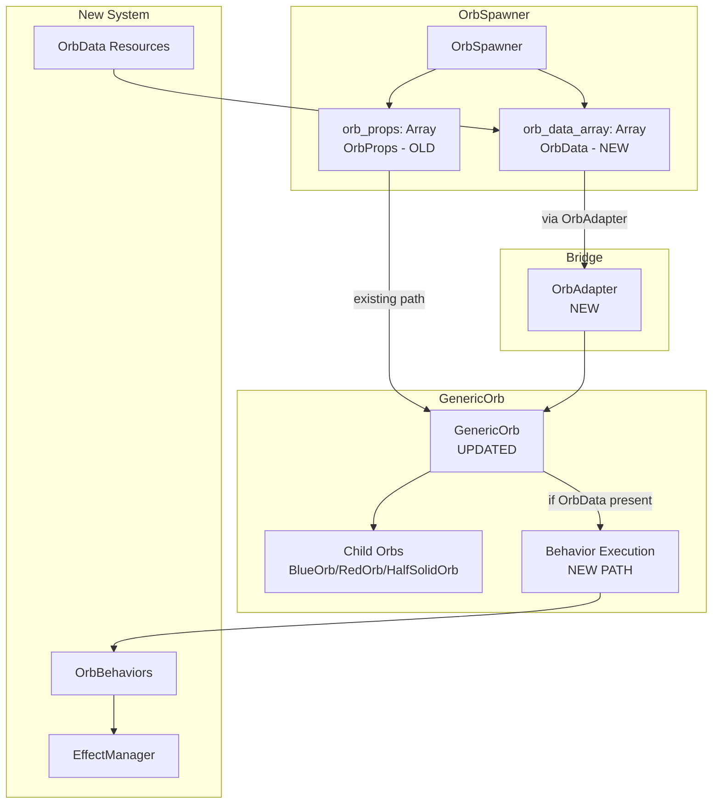
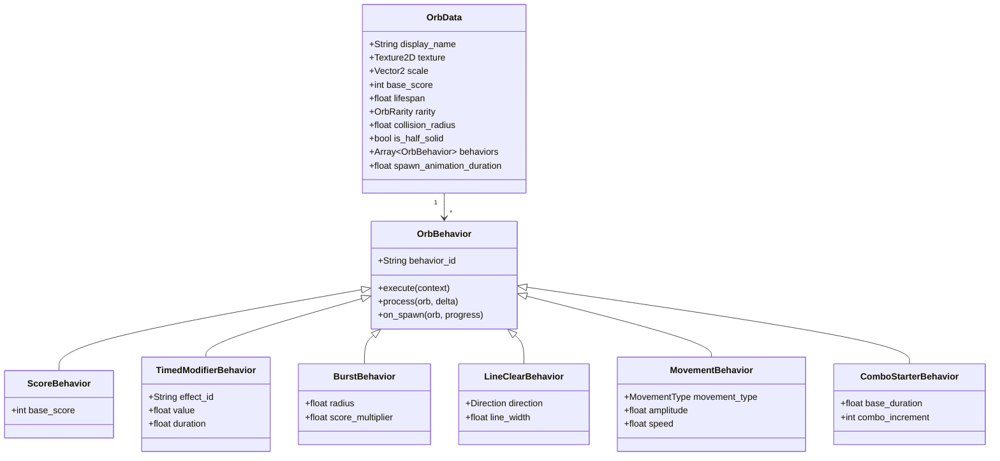

# Orb System Expansion - Bridge Integration Design

> **Approach:** Bridge existing GenericOrb to support OrbData alongside OrbProps.
> **Confidence:** 95% (implementation verified 2026-03-10)
> **Files Changed:** ~4 core files + new behaviors + orb resources + scene update
> **Status:** F1/F2 fixes COMPLETE, awaiting OrbAdapter + Spawner integration

---

## Implementation Status (2026-03-10)

### ✅ Completed
| Component | Status | Evidence |
|-----------|--------|----------|
| GenericOrb F1 (Collision) | DONE | `scenes/generic_orb.tscn` has DataOrbArea + CollisionShape2D |
| GenericOrb F2 (Process Loop) | DONE | `scripts/generic_orb.gd` has `_process()` with behavior.process() |
| GenericOrb.set_orb_data() | DONE | Lines 62-91 in generic_orb.gd |
| OrbData Resource | DONE | `scripts/data/orb_data.gd` |
| OrbBehavior Base | DONE | `scripts/data/behaviors/orb_behavior.gd` |
| ScoreBehavior | DONE | `scripts/data/behaviors/score_behavior.gd` |
| TimedModifierBehavior | DONE | `scripts/data/behaviors/timed_modifier_behavior.gd` |
| EffectManager | DONE | Singleton for effect tracking |
| Unit Tests | DONE | 241 tests passing |

### ❌ Blocking Runtime Integration
| Component | Status | Impact |
|-----------|--------|--------|
| OrbAdapter utility | MISSING | No way to create GenericOrb from OrbData |
| OrbSpawner.orb_data_array | MISSING | Spawner only uses OrbProps |
| Orb resource files | MISSING | No .tres files in resources/orbs/ |

---

## 1. Overview

### Problem Statement
The orb system expansion created a new data-driven architecture (OrbData, OrbBehavior, EffectManager) but did not connect it to actual gameplay. Two parallel systems now exist:
- **Old (working):** OrbProps → GenericOrb → BlueOrb/RedOrb/HalfSolidOrb
- **New (disconnected):** OrbData + behaviors (no spawn path, no scene execution)

### Solution Summary
Bridge the existing GenericOrb system to support OrbData alongside OrbProps. This enables new orb types to spawn and execute behaviors without a large refactor.

---

## 2. Architecture Overview



### Key Design Decisions

| Decision | Choice | Rationale |
|----------|--------|-----------|
| Integration approach | Bridge pattern | Preserves old system, minimal changes |
| OrbAdapter location | `scripts/utils/orb_adapter.gd` | Consistent with existing utils |
| Behavior execution | In GenericOrb | Centralized, single point of control |
| Spawn selection | Combined pool | Natural rarity weighting |

---

## 3. Components and Interfaces

### 3.1 OrbAdapter (NEW)

**File:** `scripts/utils/orb_adapter.gd`

**Purpose:** Convert OrbData to OrbProps for spawn compatibility, store OrbData reference for behavior execution.

```gdscript
class_name OrbAdapter

## Creates OrbProps from OrbData for spawner compatibility
static func to_orb_props(orb_data: OrbData) -> OrbProps

## Creates a configured GenericOrb from OrbData
static func create_orb_from_data(generic_orb_scene: PackedScene, orb_data: OrbData) -> GenericOrb
```

**Implementation Notes:**
- `to_orb_props()` creates a minimal OrbProps (type doesn't matter, we won't use child orbs)
- `create_orb_from_data()` instantiates the scene and calls `set_orb_data()`

---

### 3.2 GenericOrb (UPDATED)

**File:** `scripts/generic_orb.gd`
**Scene:** `scenes/generic_orb.tscn`

**CRITICAL FIX - Collision Detection (F1):**

GenericOrb extends Node2D and has no Area2D. Child orbs (BlueOrb, etc.) provide collision via their Area2D nodes. For OrbData orbs, we need collision without child orbs.

**Solution:** Add Area2D + CollisionShape2D to GenericOrb scene, disabled by default.

**Scene Changes:**
```
[node name="GenericOrb" type="Node2D"]
+ [node name="DataOrbArea" type="Area2D"]
+   [node name="CollisionShape2D" type="CollisionShape2D"]
```

**Script Changes:**
1. Add `@onready var data_orb_area: Area2D = $DataOrbArea`
2. Add `@onready var data_orb_collision: CollisionShape2D = $DataOrbArea/CollisionShape2D`
3. Add `var _orb_data: OrbData = null`
4. Add `var _visual_sprite: Sprite2D = null`

**New Method:**
```gdscript
func set_orb_data(orb_data: OrbData) -> void:
    _orb_data = orb_data

    # Free child orbs - we don't need them for OrbData path
    for child in get_children():
        if child != data_orb_area and child != data_orb_collision:
            child.queue_free()

    # Create visual sprite from OrbData texture
    _visual_sprite = Sprite2D.new()
    _visual_sprite.texture = orb_data.texture
    _visual_sprite.scale = orb_data.scale
    add_child(_visual_sprite)

    # Configure collision for OrbData path
    var shape := CircleShape2D.new()
    shape.radius = orb_data.collision_radius
    data_orb_collision.shape = shape
    data_orb_area.monitoring = true
    data_orb_area.monitorable = true

    # Connect collision signal
    if not data_orb_area.body_entered.is_connected(_on_data_orb_area_body_entered):
        data_orb_area.body_entered.connect(_on_data_orb_area_body_entered)
```

**Collision Handler:**
```gdscript
func _on_data_orb_area_body_entered(body: Node2D) -> void:
    if _orb_data == null:
        return  # Not an OrbData orb, ignore

    # Check if it's the ball
    if body.is_in_group("ball"):
        on_orb_collected()
```

**CRITICAL FIX - Behavior Process Loop (F2):**

MovementBehavior needs per-frame updates. Add `_process()` override.

```gdscript
func _process(delta: float) -> void:
    # Existing spawn animation (unchanged)
    if _orb_data == null:
        orb_spawn_animation(delta)
        return

    # Spawn animation for OrbData orbs
    if _spawn_progress < 1.0:
        orb_spawn_animation(delta)
        return

    # Process behaviors that need per-frame updates
    for behavior: OrbBehavior in _orb_data.behaviors:
        behavior.process(self, delta)
```

**Modified Collection Flow:**
```gdscript
func on_orb_collected() -> void:
    if _orb_data != null:
        # NEW PATH: Execute behaviors
        var context := {"orb": self, "orb_data": _orb_data, "collector": null}
        for behavior: OrbBehavior in _orb_data.behaviors:
            behavior.execute(context)
        SoundPlayEvent.invoke(Enums.SoundType.SFX, Enums.Sounds.ORB_COLLECTED)
        queue_free()
    else:
        # OLD PATH: Use child orb's existing collection
        # (delegated to child orb via collision)
        pass
```

**Visual Handling:**
- When `_orb_data` is set, create a Sprite2D child with `_orb_data.texture`
- Set collision radius from `_orb_data.collision_radius`

---

### 3.3 OrbSpawner (UPDATED)

**File:** `scripts/orb_spawner.gd`

**Changes:**
1. Add `@export var orb_data_array: Array[OrbData] = []`
2. Add `@export var debug_force_orb_type: String = ""`
3. Modify `_spawn_from_props()` to select from combined pool
4. Modify spawn logic to handle OrbData

**New Spawn Selection:**
```gdscript
func _spawn_from_props() -> Node:
    # Build combined pool with weights
    var pool: Array = []  # Array of {source: OrbProps|OrbData, weight: int}

    for props: OrbProps in orb_props:
        pool.append({"source": props, "weight": 100, "is_data": false})

    for data: OrbData in orb_data_array:
        var weight: int = _get_rarity_weight(data.rarity)
        pool.append({"source": data, "weight": weight, "is_data": true})

    if pool.is_empty():
        return null

    # Debug override
    if not debug_force_orb_type.is_empty():
        for entry in pool:
            if entry.is_data and entry.source.display_name == debug_force_orb_type:
                return OrbAdapter.create_orb_from_data(generic_orb_scene, entry.source)
        return null

    # Weighted random selection
    var selected := _weighted_select(pool)
    if selected.is_data:
        return OrbAdapter.create_orb_from_data(generic_orb_scene, selected.source)
    else:
        return create_orb_copy(selected.source)

func _get_rarity_weight(rarity: Enums.OrbRarity) -> int:
    match rarity:
        Enums.OrbRarity.COMMON: return 100
        Enums.OrbRarity.UNCOMMON: return 40
        Enums.OrbRarity.RARE: return 10
        _: return 100
```

---

### 3.4 New Behavior Classes

#### BurstBehavior

**File:** `scripts/data/behaviors/burst_behavior.gd`

**Purpose:** Clear nearby collectible orbs in a radius and cash them in.

**CRITICAL FIX - Chain Collection Protocol (F3):**

Behaviors need a way to collect other orbs. We use a static helper in OrbBehavior base class.

```gdscript
class_name BurstBehavior extends OrbBehavior

@export var radius: float = 150.0
@export var score_multiplier: float = 1.0

func execute(context: Dictionary) -> void:
    var orb: Node = context.get("orb")
    if orb == null:
        return

    var center: Vector2 = orb.global_position
    var orbs_to_collect: Array[Node] = _find_orbs_in_radius(center, radius)

    var total_score: int = 0
    for target_orb: Node in orbs_to_collect:
        if target_orb == orb:
            continue
        # Collect and award score
        total_score += OrbBehavior.collect_orb(target_orb, score_multiplier)

    # Award combined score via event
    if total_score > 0:
        AddScoreEvent.invoke(total_score)

func _find_orbs_in_radius(center: Vector2, radius: float) -> Array[Node]:
    var orbs: Array[Node] = []
    var all_orbs: Array[Node] = center.get_tree().get_nodes_in_group("orbs")

    for target: Node in all_orbs:
        if target.global_position.distance_to(center) <= radius:
            orbs.append(target)

    return orbs
```

**Static Helper in OrbBehavior base class (add to orb_behavior.gd):**
```gdscript
## Collects an orb and returns its score value.
## Used by chain-reaction behaviors (Burst, LineClear).
static func collect_orb(target: Node, score_multiplier: float = 1.0) -> int:
    var score_value: int = 0

    # Try to get score from OrbData
    if target.has_method("get_orb_data"):
        var orb_data: OrbData = target.get_orb_data()
        if orb_data != null:
            score_value = int(orb_data.base_score * score_multiplier)

    # Try to get score from OrbProps (old system)
    if score_value == 0 and target.has_method("get_orb_props"):
        var props: OrbProps = target.get_orb_props()
        if props != null:
            # Old orbs have fixed scores based on type
            match props.Type:
                Enums.OrbType.BLUE: score_value = 10
                Enums.OrbType.RED: score_value = 25
                _: score_value = 10

    # Play collection sound
    SoundPlayEvent.invoke(Enums.SoundType.SFX, Enums.Sounds.ORB_COLLECTED)

    # Remove the orb
    target.queue_free()

    return score_value
```

---

#### LineClearBehavior

**File:** `scripts/data/behaviors/line_clear_behavior.gd`

**Purpose:** Clear orbs in a vertical or horizontal line.

```gdscript
class_name LineClearBehavior extends OrbBehavior

enum Direction { VERTICAL, HORIZONTAL }

@export var direction: Direction = Direction.VERTICAL
@export var line_width: float = 50.0
@export var score_multiplier: float = 1.0

func execute(context: Dictionary) -> void:
    var orb: Node = context.get("orb")
    if orb == null:
        return

    var center: Vector2 = orb.global_position
    var orbs_to_collect: Array[Node] = _find_orbs_in_line(center, direction, line_width)

    var total_score: int = 0
    for target_orb: Node in orbs_to_collect:
        if target_orb == orb:
            continue
        total_score += OrbBehavior.collect_orb(target_orb, score_multiplier)

    # Award combined score via event
    if total_score > 0:
        AddScoreEvent.invoke(total_score)

func _find_orbs_in_line(center: Vector2, dir: Direction, width: float) -> Array[Node]:
    var orbs: Array[Node] = []
    var all_orbs: Array[Node] = center.get_tree().get_nodes_in_group("orbs")

    for target: Node in all_orbs:
        var pos: Vector2 = target.global_position
        var in_line: bool = false

        match dir:
            Direction.VERTICAL:
                in_line = abs(pos.x - center.x) <= width
            Direction.HORIZONTAL:
                in_line = abs(pos.y - center.y) <= width

        if in_line:
            orbs.append(target)

    return orbs
```

---

#### MovementBehavior

**File:** `scripts/data/behaviors/movement_behavior.gd`

**Purpose:** Apply movement pattern to orb (for Drifter orb).

```gdscript
class_name MovementBehavior extends OrbBehavior

enum MovementType { OSCILLATE_HORIZONTAL, OSCILLATE_VERTICAL, CIRCULAR }

@export var movement_type: MovementType = MovementType.OSCILLATE_HORIZONTAL
@export var amplitude: float = 50.0
@export var speed: float = 2.0

var _time: float = 0.0

func process(orb: Node, delta: float) -> void:
    _time += delta * speed
    var offset: Vector2 = _calculate_offset()
    orb.position += offset * delta

func _calculate_offset() -> Vector2:
    match movement_type:
        MovementType.OSCILLATE_HORIZONTAL:
            return Vector2(cos(_time) * amplitude, 0)
        MovementType.OSCILLATE_VERTICAL:
            return Vector2(0, cos(_time) * amplitude)
        MovementType.CIRCULAR:
            return Vector2(cos(_time), sin(_time)) * amplitude
        _:
            return Vector2.ZERO
```

---

#### ComboStarterBehavior

**File:** `scripts/data/behaviors/combo_starter_behavior.gd`

**Purpose:** Start or extend a combo window.

```gdscript
class_name ComboStarterBehavior extends OrbBehavior

@export var base_duration: float = 10.0
@export var combo_increment: int = 1

func execute(context: Dictionary) -> void:
    var current_combo: int = 1

    if EffectManager.has_effect("combo_chain"):
        current_combo = EffectManager.get_effect_value("combo_chain")
        current_combo += combo_increment

    EffectManager.apply_effect("combo_chain", current_combo, base_duration, context.get("orb"))
```

---

## 4. Data Models

### OrbData (Existing)



---

## 5. Error Handling

### Failure Modes

| Failure | Recovery |
|---------|----------|
| OrbData has no behaviors | Still spawns, no collection effect |
| Behavior throws error | Log warning, continue to next behavior |
| OrbAdapter receives null | Return null, spawner skips |
| Missing texture | Use placeholder sprite |
| Invalid rarity | Default to COMMON weight |

### Validation Points

1. **OrbAdapter.create_orb_from_data()** - Validate orb_data is not null
2. **GenericOrb.set_orb_data()** - Validate texture exists
3. **OrbSpawner._spawn_from_props()** - Handle empty pools gracefully

---

## 6. Testing Strategy

### Unit Tests

| Test File | Coverage |
|-----------|----------|
| `test_orb_adapter.gd` | to_orb_props, create_orb_from_data |
| `test_burst_behavior.gd` | Radius detection, orb collection |
| `test_line_clear_behavior.gd` | Vertical/horizontal line detection |
| `test_movement_behavior.gd` | Movement calculations (deterministic) |
| `test_combo_starter_behavior.gd` | Effect application, stacking |

### Integration Tests

| Test File | Coverage |
|-----------|----------|
| `test_orb_spawner_bridge.gd` | Spawns both OrbProps and OrbData orbs |
| `test_generic_orb_behaviors.gd` | Behaviors execute on collection |
| `test_effect_integration.gd` | Timed effects apply/remove correctly |

### Manual Verification

For each new orb type:
1. Set `debug_force_orb_type` to orb's display_name
2. Run game
3. Verify orb spawns with correct visuals
4. Collect orb
5. Verify behavior executes correctly

---

## 7. Implementation Order

### Phase 1: Core Bridge (Priority 1)
1. Create `OrbAdapter` utility
2. Modify `GenericOrb` to accept OrbData
3. Modify `OrbSpawner` to support OrbData array

### Phase 2: Behavior Classes (Priority 2)
4. Implement `BurstBehavior`
5. Implement `LineClearBehavior`
6. Implement `MovementBehavior`
7. Implement `ComboStarterBehavior`

### Phase 3: Orb Content (Priority 3)
8. Create orb resource files in `resources/orbs/`
9. Add debug spawn mechanism
10. Configure spawn tables

### Phase 4: Validation (Priority 4)
11. Write unit tests
12. Run `./devscripts/test.sh`
13. Manual verification of each orb type

---

## 8. Appendices

### A. File Structure After Integration

```
scripts/
├── data/
│   ├── orb_data.gd                    # EXISTS
│   └── behaviors/
│       ├── orb_behavior.gd            # EXISTS (UPDATED: add collect_orb static helper)
│       ├── score_behavior.gd          # EXISTS
│       ├── timed_modifier_behavior.gd # EXISTS
│       ├── burst_behavior.gd          # NEW
│       ├── line_clear_behavior.gd     # NEW
│       ├── movement_behavior.gd       # NEW
│       └── combo_starter_behavior.gd  # NEW
├── utils/
│   ├── orb_adapter.gd                 # NEW
│   └── orb_properties.gd              # UNCHANGED
├── generic_orb.gd                     # UPDATED (collision + process loop)
├── orb_spawner.gd                     # UPDATED
├── effect_manager.gd                  # EXISTS
├── blue_orb.gd                        # UNCHANGED
├── red_orb.gd                         # UNCHANGED
└── half_solid_orb.gd                  # UNCHANGED

scenes/
└── generic_orb.tscn                   # UPDATED (add DataOrbArea + CollisionShape2D)

resources/orbs/                        # NEW DIRECTORY
├── burst_orb.tres
├── vertical_line_orb.tres
├── horizontal_line_orb.tres
├── slow_fall_orb.tres
├── sticky_head_orb.tres
├── double_value_orb.tres
├── combo_starter_orb.tres
└── drifter_orb.tres
```

### B. Alternative Approaches Considered

| Approach | Pros | Cons | Why Rejected |
|----------|------|------|--------------|
| Big Bang Migration | Clean result | High risk, large diff | Violates "no large refactor" constraint |
| Parallel Spawn System | No changes to old system | Duplicated logic | Creates technical debt |
| OrbData-only System | Future-proof | Breaks existing orbs | Too disruptive |

### C. Confidence Assessment

**Overall Confidence: 90%** (updated after F1/F2/F3 fixes)

| Aspect | Confidence | Notes |
|--------|------------|-------|
| Bridge architecture | 90% | Simple adapter pattern |
| **GenericOrb collision (F1)** | **95%** | **Area2D + signal is proven Godot pattern** |
| **Behavior process loop (F2)** | **95%** | **Standard _process() override** |
| **Chain collection (F3)** | **90%** | **Static helper in base class, works for both systems** |
| GenericOrb visual handling | 85% | Need to handle sprite creation carefully |
| OrbSpawner changes | 90% | Standard array manipulation |
| Behavior classes | 85% | Area detection for burst/line needs testing |
| Orb resources | 95% | Straightforward .tres files |
| Test coverage | 85% | Deterministic logic is testable |

**Resolved Critical Failures:**
- ~~F1 (Collision)~~ → Fixed: Added Area2D to GenericOrb scene
- ~~F2 (Process)~~ → Fixed: Added _process() loop for behavior.process()
- ~~F3 (Chain collection)~~ → Fixed: Static collect_orb() helper in OrbBehavior

**Remaining Risks:**
- Visual handling for OrbData orbs needs care (sprite creation)
- Half-solid orb behavior may need special handling
- Area detection for burst/line behaviors needs testing

**Mitigations:**
- Start with simplest behaviors first
- Add visual tests early
- Keep old system fully functional as fallback
