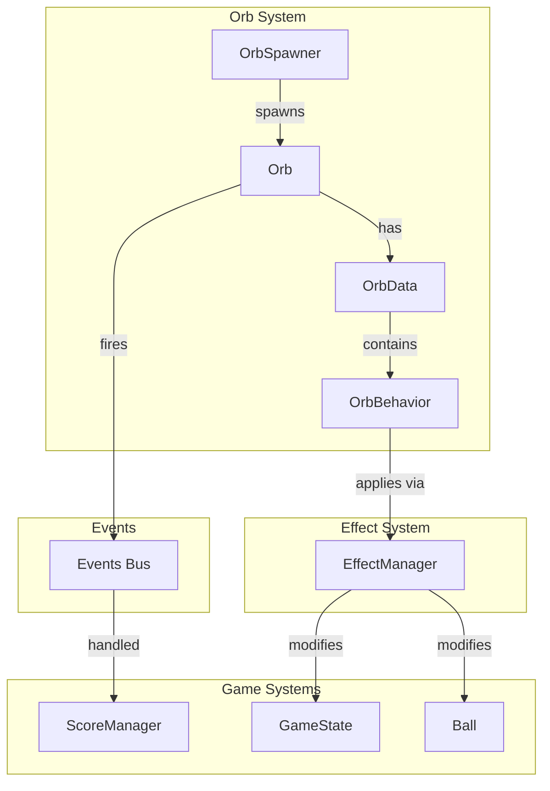
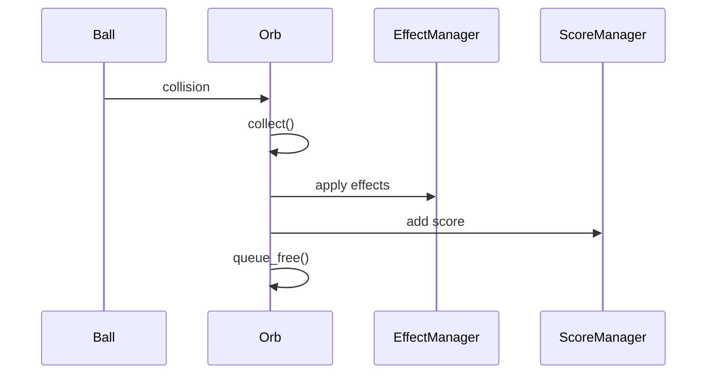

# Orb System Expansion - Design Document

> **Full detailed design:** See `design/detailed-design.md` for complete implementation guidance.
> **Implementation plan:** See `implementation/plan.md` for 25-step execution roadmap.

---

## Overview

Expand the orb system from 3 hardcoded orb types to a modular, data-driven system supporting 12+ orb types with effects, stacking, and varied behaviors.

### Goals
- Replace duplicated orb scripts with unified data-driven architecture
- Support instant effects, timed effects, stacking, movement, and chain reactions
- Enable new orb creation via Resource files (no new scripts for most cases)
- Maintain existing gameplay feel and scoring balance

---

## Architecture Overview



---

## Key Components

### 1. OrbData (Resource)
**File:** `scripts/data/orb_data.gd`

Defines all orb properties:
- Display: name, texture, scale
- Gameplay: base_score, lifespan, rarity
- Physics: collision_radius, is_half_solid
- Behaviors: Array[OrbBehavior]

### 2. OrbBehavior (Abstract Resource)
**File:** `scripts/data/behaviors/orb_behavior.gd`

Pluggable behavior system:
- `execute(context)` - called on collection
- `process(orb, delta)` - called each frame
- `on_spawn(orb, progress)` - during spawn animation

### 3. Concrete Behaviors
| Behavior | Purpose |
|----------|---------|
| ScoreBehavior | Adds score, applies multipliers |
| TimedModifierBehavior | Applies timed effects |
| MovementBehavior | Drifting/orbiting movement |
| ChainReactionBehavior | Burst radius collection |
| LineClearBehavior | Vertical/horizontal line clear |

### 4. EffectManager (Autoload)
**File:** `scripts/effect_manager.gd`

Central effect tracking:
- Tracks active effects with duration
- Handles stacking rules
- Applies global effects (time_scale)
- Clears on game over

### 5. Orb (Unified Scene)
**File:** `scripts/orb.gd`, `scenes/orb.tscn`

Single orb scene replacing all existing orb types:
- Reads OrbData at spawn
- Executes behaviors on collection
- Handles spawn animation
- Manages lifespan timer

### 6. OrbSpawner (Updated)
**File:** `scripts/orb_spawner.gd`

Weighted spawn system:
- Uses OrbSpawnEntry resources
- Respects rarity tiers
- Enforces max orbs limit

---

## Data Flow



---

## Effect Stacking Rules

| Effect | Duration | Stack Behavior | Cap |
|--------|----------|----------------|-----|
| Score Multiplier | 45s | Multiply | 10x |
| Slow Fall | 45s | Multiply | 90% reduction |
| Time Slow | 10s | Multiply | 0.25x |
| Combo Chain | 10s | Increment | None |
| Double Value | Until used | N/A | N/A |

---

## Orb Pack Summary

| Orb | Rarity | Score | Behaviors |
|-----|--------|-------|-----------|
| Blue | COMMON | 2 | ScoreBehavior(2) |
| Red | COMMON | 3 | ScoreBehavior(3) |
| Half-Solid | RARE | 8 | ScoreBehavior(8), half-solid physics |
| Score Multiplier | UNCOMMON | 3 | ScoreBehavior(3), TimedModifier(2x, 45s) |
| Slow Fall | UNCOMMON | 2 | ScoreBehavior(2), TimedModifier(0.5, 45s) |
| Burst | RARE | 8 | ScoreBehavior(8), ChainReaction(150) |
| Drifter | UNCOMMON | 2 | ScoreBehavior(2), Movement(50, oscillate) |
| Double Value | UNCOMMON | 1 | ScoreBehavior(1), TimedModifier(until used) |
| Time Slow | RARE | 5 | ScoreBehavior(5), TimedModifier(0.5, 10s) |
| Combo Starter | RARE | 3 | ScoreBehavior(3), TimedModifier(combo, 10s) |
| Vertical Line | RARE | 5 | ScoreBehavior(5), LineClear(VERTICAL) |
| Horizontal Line | RARE | 5 | ScoreBehavior(5), LineClear(HORIZONTAL) |

---

## File Structure

```
scripts/
├── data/
│   ├── orb_data.gd                    # NEW
│   ├── orb_spawn_entry.gd             # NEW
│   └── behaviors/
│       ├── orb_behavior.gd            # NEW (abstract)
│       ├── score_behavior.gd          # NEW
│       ├── timed_modifier_behavior.gd # NEW
│       ├── chain_reaction_behavior.gd # NEW
│       ├── movement_behavior.gd       # NEW
│       └── line_clear_behavior.gd     # NEW
├── effect_manager.gd                  # NEW (autoload)
├── orb.gd                             # NEW (replaces 4 scripts)
├── orb_spawner.gd                     # UPDATED
└── ball.gd                            # UPDATED (poll EffectManager)

resources/orbs/                        # NEW directory
├── blue_orb.tres
├── red_orb.tres
├── half_solid_orb.tres
└── ... (9 new orb resources)

scenes/orb.tscn                        # NEW (replaces 4 scenes)
```

---

## Testing Strategy

### Unit Tests
- `test_orb_data.gd` - OrbData creation, defaults
- `test_orb_behaviors.gd` - Each behavior's execute()
- `test_effect_manager.gd` - Apply/remove/stack/expire
- `test_orb_spawner.gd` - Weighted selection, max limit
- `test_orb_scoring.gd` - Score with multipliers

### Integration Tests
- `test_orb_collection_flow.gd` - Full collection flow
- `test_chain_reaction.gd` - Burst orb behavior
- `test_line_clear.gd` - Line orb behavior

### Validation
- `./devscripts/test.sh` passes
- Manual gameplay session
- All 12 orb types spawn and function correctly

---

## Acceptance Criteria

### Phase 1: Core Architecture
- [ ] OrbData resource class with all properties
- [ ] OrbBehavior abstract class
- [ ] EffectManager autoload passing unit tests
- [ ] Unified Orb scene spawns correctly
- [ ] Test suite passes

### Phase 2: Migration
- [ ] Blue/Red/Half-Solid as OrbData resources
- [ ] Old scenes/scripts deleted
- [ ] Gameplay parity verified

### Phase 3: New Orb Pack
- [ ] All 9 new orb types implemented
- [ ] Each has unit tests
- [ ] Spawn table configured

### Final
- [ ] Full test suite passes
- [ ] No console errors
- [ ] Gameplay session with all orbs

---

## References

- **Detailed Design:** `design/detailed-design.md`
- **Implementation Plan:** `implementation/plan.md` (25 steps)
- **Research:** `research/*.md`
- **Q&A History:** `idea-honing.md`
